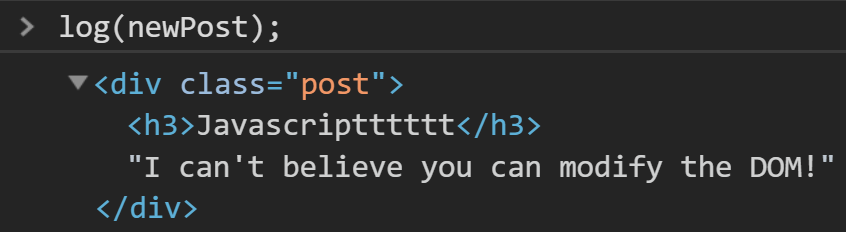

# DOM


- DOM has a tree structure, and is painted to the browser
- The tree is built first, and then properly painted onto the browser
- Any time we want to edit the DOM, it has to go through a process

## Selectors

```js
// get by id, sinse id is unique, return one element
const headerText = document.getElementById("headerText");
// edit content inside
headerText.innerText = "Geddit";
headerText.innerHTML = "<em>I am an h2</em>";
// Can change the css style
headerText.style.color = "orangered";
headerText.style.marginLeft = "300px";

// get by class name, returns a list of element with class, instead of only one
const postCollection = document.getElementsByClassName("post");
// select element from the list
postCollection[1].style.backgroundColor = "seagreen";
// loop through every element with the class name
for (let i = 0; i < postCollection.length; i++) {
  postCollection[i].style.backgroundColor = "seagreen";
}
// get by tag name, returns a list of element with tag
const listElements = document.getElementsByTagName("li");

// query selector, returns one element
const postsArea1 = document.querySelector("#posts");
// query selector all, returns a list of element
const allPosts = document.querySelectorAll(".post");
```

## DOM Hierarchy

```js
const postsArea = document.querySelector("#posts");
log(postsArea.parentElement);
log(postsArea.parentElement.parentElement);
log(postsArea.children);	// list of element (children)
log(postsArea.firstElementChild);	// first child in children
log(postsArea.lastElementChild);	// last child in children
log(postsArea.nextElementSibling);	// next sibling element in html, same level
log(postsArea.previousElementSibling);	// previous sibling element in html, same level
```

## Creating Element

```js
const newPost = document.createElement("div");
newPost.className = "post";

// create <h3>Javascriptttttt</h3>
const newPostTitle = document.createTextNode("Javascriptttttt");
const newPostTitleContainer = document.createElement("h3");
newPostTitleContainer.appendChild(newPostTitle);

const newPostContent = document.createTextNode(
  "I can't believe you can modify the DOM!"
);
newPost.appendChild(newPostTitleContainer);
newPost.appendChild(newPostContent);
```



Manipulaing DOM can be very complicated if we do it manually.

Instead, frameworks like `React`, `Vue`, and `Angular` have an extra layer to their DOM manipulation system

# The Virtual DOM

- An *in-memory* representation of the DOM
- Changes to the virtual DOM don’t need to go through the process of painting on the browser, so saves resources
- This means we can create completely new DOM trees very quickly

When rendering a component, a virtual DOM tree is quickly made in memory

```jsx
render (
	<div>
  	<h1>{ this.state.title }</h1>
    <h3>{ this.state.subtitle }</h3>
  </div>
)
```

React will then take the Virtual DOM tree and figure out an efficient way of painting the elements in the browser

- A*reconciliation*algorithm 

## Reconciliation

- Smart algorithm for finding differences
- Attempts to only change child DOM nodes that are needed
- Helped by things like *keys* that we add to lists

## Transpiling

- We saw a lot of new syntax
- Much of it is converted to the JavaScript we’ve seen before through the help of a conversion tool called a **transpiler**
- For example, `Babel`


