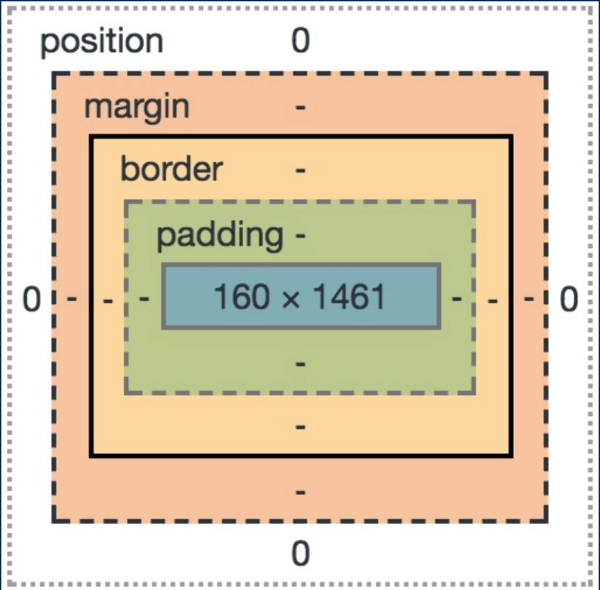
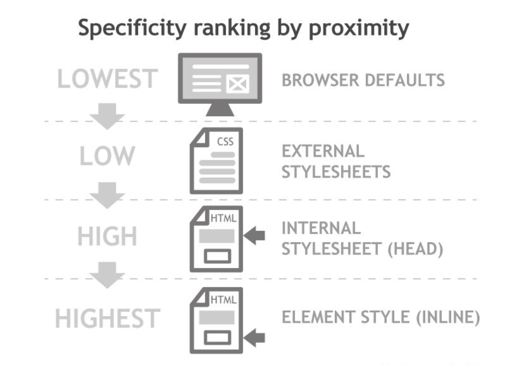

# HTML & CSS

## HTML

HTML is a **markup language**

- Describes a web page's **content** and **structure**
- Not a programming language

### Valid HTML

```html
<!DOCTYPE html>
<html lang="en">
  <head>
    <meta charset="UTF-8" />
    <!-- title is a must-have for a valid HTML, but browser can render page without it -->
    <title>Document</title>
  </head>
  <body></body>
</html>
```

## CSS

### Definition

- Cascading Style Sheets
- A language that describes the **Style** of web pages
- Cascading: How we style a web page has priority rules

```css
selector {
  property1: value;
  property2: value;
}
```

### Inline and Block elements

- There are two ways of displaying elements
- **Block** (`<p>`, `<h1>`, `<h2>`, `<ul>`)
  - 自占一行
  - Height and width can be specified and changed
  - By default:
    - Width is full width of parent element
    - Height is enough to fit the content
  - Forces creation of newlines
- **Inline Block** (`<strong>`, `a`, `<br>`, ``)
  - Don’t have defined width/height
  - Can’t have block element inside it
  - Inline elements that can have a height/width: ``
- `<div>` and `<span>`
  - Two **non-semantic** elements
  - Generic - no specific purpose
  - `<span>` is a generic inline element
  - `<div>` is a generic block element
  - Are used more for creating **natural divisions** throughout your page

### CSS Selector

- **CSS Classes**

  ```css
  .highlight {
    background-color: yellow;
  }
  ```

- **CSS id's**

  ```css
  #navbar {
    color: white;
  }
  ```

### Combining Selectors

- **Descendant selector**

  ```css
  /* applies to all <strong> elements that are inside a <p> */
  p strong {
    background-color: yellow;
  }
  ```

- **element.class selector**

  ```css
  p.highlight {
    /* applies to all <p> elements that have class highlight */
    background-color: yellow;
  }
  ```

- **Multiple element selector**

  ```css
  p,
  strong,
  h1 {
    /* applies to all <p>, <strong>, and <h1> elements */
    background-color: yellow;
  }
  ```

### CSS Inheritance

- Children inherit parent styles in most cases

### CSS Box Model (Size and Position)

- All HTML elements considered ‘boxes’ by CSS
- Element size and position determined by values of the box model
- 
- **Size**
  - **Content**: Width and height of the content
  - **Padding**: Space between content and border
  - **Border**
  - **Margin**: Area around the border (“clearing” space)

### CSS Positioning

- Static

  - The default position (in the ‘flow’)

- Fixed

  - Fixed position in viewport
  - Does not move even with scrolling

- Relative

  - Positioned relative to **its natural location**

- Absolute
  - Positioned relative to first **non-static parent**

### Cascading Style Sheets

- **Cascade**: The order of precedence for rules on a selector

  

- External Stylesheets (import external css file)

  ```html
  <link rel="stylesheet" href="./app.css">
  ```

- Internal Stylesheet (`<head>`)

  ```html
  <head>
    <style>
      .posts h3 {
        padding-left: 20px;
      }
      
      .post.card {
        background-color: var(--background-secondary);
        color: var(--text);
      }
    </style>
  </head>
  ```


