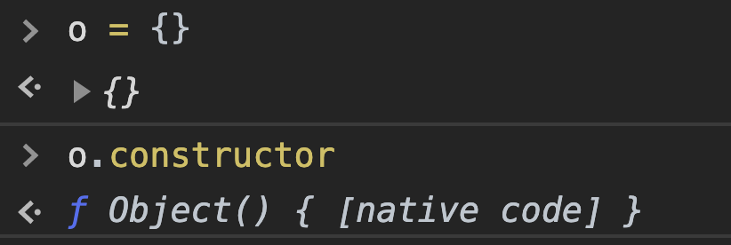

# Javascript

## Vanilla JS

* Vanilla JavaScript is just JS without any extra stuff, not a specific version.

* JS has lots of libraries and plugins

## `var`, **lexical scope**

* Variables declared using var have function scope.

* They can be accessed within the function they are declared in
  * This includes any other nested {} blocks like loops, if-statements, nested functions, etc. 
  * This is known as **lexical** scope 

## Hoisting

```js
function f() {
  if (true) {
    var a = 3;
    console.log(a);	//3
  }
  console.log(a);	//3
}
```

Why it works? `a` is defined within `if` block.

Remember that var declarations and definitions are **separate**.

All `var` variable and function **declarations** are '**hoisted**' up to the top of their function scope (or global scope if not in function) 

Variable definitions stay in place.

```js
console.log(a); // undefined, but not an error
var a = 3;

// What actually happened?
var a;	// declaration of 'a' is hoisted
console.log(a);	// undefined
a = 3;
```

The previous function `f()` example actually works like this.

```js
function f() {
  var a;
  if (true) {
    a = 3;
    console.log(a);	//3
  }
  console.log(a);	//3
}
```

* Without `var`, just `a = 7`,

  - There is no declaration to hoist.

  - `a` ends up in global scope.

  - Available to everyone in lexical scope.

  - Hard to manage

* Add `"use strict"` at top to catch errors, such as defining variables before declaring.

## ES6

- Two new ways to declare variables in ES6 (2015)

  - `let` and `const`

- Difference: **block scope**

- Only the **current block** can access them

  - Lexical scope still applies

    - Any inner block can also access

  - 打括号里面的code可以access打括号外面的（外层）declare 的变量


### `let` scope

  ```js
  function f() {
    if (true) {
      let a = 3;
      console.log(a) // block scope 
    }
    console.log(a); // ERROR! a not defined 
  }
  ```

### `const` scope

- `const` has same scope rules as `let`
- Used for variables that will not be re-assigned
- **Rule:** default to using const unless you know you will have to re-assign a variable.

## Functions

Functions in JS are "first-class" objects

- This means they can be:
  - Stored in a variable
  - Passed as an argument to a function
  - Returned from a function

Essentially used as a value anywhere values are used.

### Two ways of defining function

```js
function f1() {
  console.log("test");
}

let f2 = function() {
  console.log("test");
}
```


### Anonymous function

- Functions can be passed around without names

- Can call them using **Immediately invoked Function Expressions**

  - Wrap function in brackets and call `();`

  ```js
  (function() {
    console.log('anonymous function');
  })();
  ```

### Closures

- References to **scopes** that can be passed around
- Allows function/block scopes to be **preserved** even after they finish executing
- Function can **"carry baggage"** with it from where it was created

```js
// Case 1
function foo() {
    let a = 2;
    function inner() {
        console.log(a); // 2
    }
    return inner;
}
const bar = foo(); // foo returns a function inner()
bar();	// 2


// Case 2
function foo() {
	let a = 2;
    function inner() {
        console.log(a); // 2
    }
    a = 5;
    return inner;
}
const bar = foo(); // foo returns a function inner()
bar();	// 5
// 'a' can still change in foo(), and inner() will register those changes in the carried scope until foo() returns
```

In case 2, since a is defined before `inner()` is defined, `inner()` can access `a`. Since `a` is modified to 5 before `inner` is returned, `a=5` is carried when returned.

```js
// Another Example
function createCounter() {
	let count = 0;
	return function () {
		count += 1;
		return count;
	}
}
const tmp = createCounter();	
/*
ƒ () {
		count += 1;
		return count;
	}
*/
tmp()	// 1
```

```js
// Intend to print 1,2,3,4,5
for (var i = 1; i <= 5; i++) {
	setTimeout(function () {
		log(i);
	}, i * 1000);
}
// The above code will print 5 6's, due to closure. i reference to the same variable, which becomes 6 before the first setTimeout callback is activated

for (var i = 1; i <= 5; i++) {
	(function () {
		const j = i; // j is function scoped in the anonymous function
		setTimeout(function () {
			log(j);
		}, i * 1000);
	})();
}

for (var i = 1; i <= 5; i++) {
    setTimeout(function(index) {
        return function() {
            console.log(index);
        };
    }(i), 1000 * i);
}
// The above two for loops are the same and will print 1, 2, 3, 4, 5
// j is the closure, instead of i
// Each setTimeout's closure is a different j, not the same number, thus won't repeat

// The following code uses "let" instead of var
// let uses block scope
for (let i = 1; i <= 5; i++) {
	setTimeout(function () {
		log(i);
	}, i * 1000);
}
// This would print 1, 2, 3, 4, 5
```

### Arrays

```js
const a = [1, "hi", function() {}];
// indexing
a[0];
// Mutable
a[1] = 50;
a.length;	// length

typeof(a)	// "object", not a primitive type
```

### Objects

- An object in JS is simply a set of key-value pairs
- Keys are called "properties"
  - Can be strings (or Symbols in ES6)
- Values can be of any type
  - Can make complex data structures

**Create Objects**

```js
const student = { name: ‘Jimmy’, year: 2}; 
const student = {“name”: ‘Jimmy’, “year”: 2}; // quotes are optional

// Properties can be added and changed
student.year = 3;
student.age = 20;
```

### Functions as properties

```js
const student = { name: ‘Jimmy’, year: 2}; 
student.sayName = function() {
	console.log("My name is " + this.name);
}
student.sayName();	// "My name is Jummy"
```

What is `this` keyword?

### `this` keyword

- Refers to the containing object of the call-site of a function, not where the function is defined.
- Context-dependent
  - Value of this is not obvious from reading function definition
- Can be changed by using `bind()`, `call()`, `apply()`

## "Object-Oriented" JS

### Classes

Classes do not exist in JavaScript. At least, not in the general OOP way.

Instead of making 'instances' or copies of classes and putting them in some hierarchy.. 

- JS works on a ***delegation*** framework
- If a property can’t be found in an object, JS looks for that property in a *delegate object*
  - Delegate objects can be chained 

## Object

```js
const student = {
	name: 'Jimmy',
	year: 2,
	sayName: function() {
		log('My name is ' + this.name + '.')
		// Q: what is the context of this?
		// A: we don't know, until we call it
	}
}
// student is an object, "this" refers to the object
student.sayName() // My name is Jimmy.

let mySayName = student.sayName;
mySayName(); // undefined, without object, "this" has no reference
```

We can get this to work without having to explicitly call student.sayName()

```js
// Binding
mySayName = student.sayName;
const boundSayName = mySayName.bind(student)	// bind student as "this" to mySayName function
boundSayName();
```

```js
const whatYearAmI = function() {
	log(this.year)
}

const student2 = {
	name: 'Saul',
	year: 3,
	myYear: whatYearAmI,
	nested: {
		name: 'Jane',
		year: 7,
		myYear: whatYearAmI
	}
}
student2.myYear();			// 3
student2.nested.myYear();	// 7


const student3 = {
	name: 'Jane',
	year: 7,
	myYear: student2.myYear
}
student3.myYear(); 			// 7
student3.myYear.bind(student2)();   // 3, student3.myYear's "this" now refers to student2
student3.myYear.call(student2)		// 3, function called, no need to add "()"
```


## Prototyles

Prototypes are objects that are used by other objects to add delegate properties 

Prototypes are **not** superclasses - no instances are created

- An object will just have a *reference* to its prototype
- Multiple objects can have the same prototype object reference
  - No copies are made
  - Potentially save space

Main purpose of a prototype is for fast object creation

- One way to create an object is to use functions
- Similar to constructors in `Java`
- Functions have their own prototype property that is used for object creation

## `new` keyword

What does `new` do?

1. Creates an empty object
2. Adds the constructor prototype to that object
3. Call the constructor function with `this` set to the new object
4. Return the object

## `__proto__` and `prototype`

- `__proto__` is the property of an object that points to the object's prototype
- `prototype` is the property of a **function** that is used as the prototype to add to the new object when that function is called **as a constructor** 

## `Object.create()`

- Another way to create objects using prototypes is by using `Object.create(o)`
  - Creates an object with `o` as the prototype
- Can create multiple objects with the same prototype
  - But remember - all of their prototypes will point to the same reference
    - No instances or copies

## Class

- ES6 supports the `class` keyword
- But the `class` is not really a real `class`
- Mostly, it’s just a neat way to repackage prototypes and object creation in a way that’s more digestible for object-oriented programmers
  - No private variables
- JavaScript does not have classes


# Notes

Every object has a constructor, if `new` is not used to construct an object, the constructor may be the `Object` object itself.




