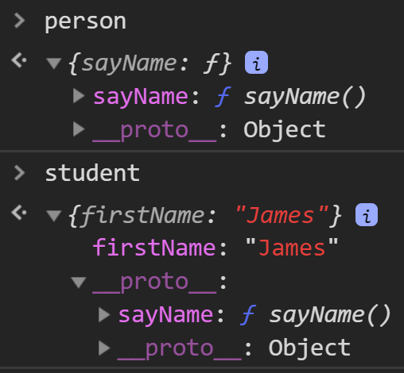
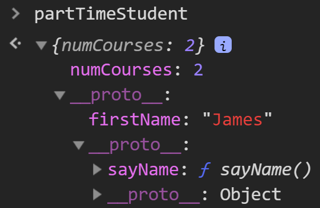
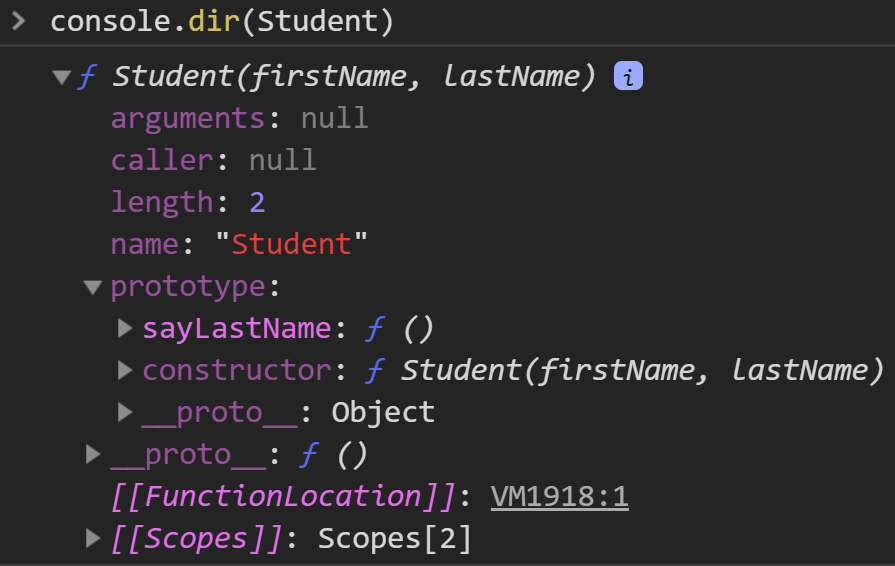

# Javascript

## Vanilla JS

* Vanilla JavaScript is just JS without any extra stuff, not a specific version.

* JS has lots of libraries and plugins

## `var`, **lexical scope**

* Variables declared using var have function scope.

* They can be accessed within the function they are declared in
  * This includes any other nested {} blocks like loops, if-statements, nested functions, etc. 
  * This is known as **lexical** scope 

## Hoisting

```js
function f() {
  if (true) {
    var a = 3;
    console.log(a);	//3
  }
  console.log(a);	//3
}
```

Why it works? `a` is defined within `if` block.

Remember that var declarations and definitions are **separate**.

All `var` variable and function **declarations** are '**hoisted**' up to the top of their function scope (or global scope if not in function) 

Variable definitions stay in place.

```js
console.log(a); // undefined, but not an error
var a = 3;

// What actually happened?
var a;	// declaration of 'a' is hoisted
console.log(a);	// undefined
a = 3;
```

The previous function `f()` example actually works like this.

```js
function f() {
  var a;
  if (true) {
    a = 3;
    console.log(a);	//3
  }
  console.log(a);	//3
}
```

* Without `var`, just `a = 7`,

  - There is no declaration to hoist.

  - `a` ends up in global scope.

  - Available to everyone in lexical scope.

  - Hard to manage
* Add `"use strict"` at top to catch errors, such as defining variables before declaring.

```js
(function() {
  "use strict";
  function foo() {
    var a = 7;
    function bar() {
      console.log(a);
      var a = 3;
    }
    bar();
  }
})();			// undefined
```

On line 7, `var a` gets hoisted to the beginning of `function bar()`, which is the same as the code below.

```js
function bar() {
    var a;
	console.log(a);
	a = 3;
}
```

The code below would work.

```js
function foo() {
  var a = 7;
  function bar() {
    console.log(a);
  }
  bar();
}
foo();			// 7
```

```js
var s = "hello";
(function() {
  console.log("Value before: " + s);
  var s = "hi";
  console.log("Value after: " + s);
})();
// output
/*
Value before: undefined
Value after: hi
*/

// Equivalent
var s = "hello";
// The hoist
(function() {
  var s;
  console.log("Value before: " + s);
  s = "hi";
  console.log("Value after: " + s);
})();
```

## ES6

- Two new ways to declare variables in ES6 (2015)

  - `let` and `const`

- Difference: **block scope**

- Only the **current block** can access them

  - Lexical scope still applies

    - Any inner block can also access

  - 打括号里面的code可以access打括号外面的（外层）declare 的变量


### `let` scope

  ```js
  function f() {
    if (true) {
      let a = 3;
      console.log(a) // block scope 
    }
    console.log(a); // ERROR! a not defined 
  }
  ```

### `const` scope

- `const` has same scope rules as `let`
- Used for variables that will not be re-assigned
- **Rule:** default to using const unless you know you will have to re-assign a variable.

## Functions

Functions in JS are "first-class" objects

- This means they can be:
  - Stored in a variable
  - Passed as an argument to a function
  - Returned from a function

Essentially used as a value anywhere values are used.

### Two ways of defining function

```js
function f1() {
  console.log("test");
}

let f2 = function() {
  console.log("test");
}
```


### Anonymous function

- Functions can be passed around without names

- Can call them using **Immediately invoked Function Expressions**

  - Wrap function in brackets and call `();`

  ```js
  (function() {
    console.log('anonymous function');
  })();
  ```

### Closures

- References to **scopes** that can be passed around
- Allows function/block scopes to be **preserved** even after they finish executing
- Function can **"carry baggage"** with it from where it was created

```js
// Case 1
function foo() {
    let a = 2;
    function inner() {
        console.log(a); // 2
    }
    return inner;
}
const bar = foo(); // foo returns a function inner()
bar();	// 2


// Case 2
function foo() {
	let a = 2;
    function inner() {
        console.log(a); // 2
    }
    a = 5;
    return inner;
}
const bar = foo(); // foo returns a function inner()
bar();	// 5
// 'a' can still change in foo(), and inner() will register those changes in the carried scope until foo() returns
```

In case 2, since a is defined before `inner()` is defined, `inner()` can access `a`. Since `a` is modified to 5 before `inner` is returned, `a=5` is carried when returned.

```js
// Another Example
function createCounter() {
	let count = 0;
	return function () {
		count += 1;
		return count;
	}
}
const tmp = createCounter();	
/*
ƒ () {
		count += 1;
		return count;
	}
*/
tmp()	// 1
```

```js
// Intend to print 1,2,3,4,5
for (var i = 1; i <= 5; i++) {
	setTimeout(function () {
		log(i);
	}, i * 1000);
}
// The above code will print 5 6's, due to closure. i reference to the same variable, which becomes 6 before the first setTimeout callback is activated

for (var i = 1; i <= 5; i++) {
	(function () {
		const j = i; // j is function scoped in the anonymous function
		setTimeout(function () {
			log(j);
		}, i * 1000);
	})();
}

for (var i = 1; i <= 5; i++) {
    setTimeout(function(index) {
        return function() {
            console.log(index);
        };
    }(i), 1000 * i);
}
// The above two for loops are the same and will print 1, 2, 3, 4, 5
// j is the closure, instead of i
// Each setTimeout's closure is a different j, not the same number, thus won't repeat

// The following code uses "let" instead of var
// let uses block scope
for (let i = 1; i <= 5; i++) {
	setTimeout(function () {
		log(i);
	}, i * 1000);
}
// This would print 1, 2, 3, 4, 5
```

**Another Example**

```js
const stringAdder = function() {
  let x = "";
  return function(s) {
    x = x + s;
    return x;
  };
};

adder = stringAdder();
adder("U");					// "U"
adder("of");				// "Uof"
adder("T");					// "UofT"

adder2 = stringAdder();
adder2("new");				// "new"
```

For each new String Adder, the closure "x" will be a new one.

### Arrays

```js
const a = [1, "hi", function() {}];
// indexing
a[0];
// Mutable
a[1] = 50;
a.length;	// length

typeof(a)	// "object", not a primitive type
```

### Objects

- An object in JS is simply a set of key-value pairs
- Keys are called "properties"
  - Can be strings (or Symbols in ES6)
- Values can be of any type
  - Can make complex data structures

**Create Objects**

```js
const student = { name: 'Jimmy', year: 2}; 
const student = {"name": 'Jimmy', "year": 2}; // quotes are optional

// Properties can be added and changed
student.year = 3;
student.age = 20;
```

### Functions as properties

```js
const student = { name: 'Jimmy', year: 2}; 
student.sayName = function() {
	console.log("My name is " + this.name);
}
student.sayName();	// "My name is Jummy"
```

What is `this` keyword?

### `this` keyword

- Refers to the containing object of the call-site of a function, not where the function is defined.
- Context-dependent
  - Value of this is not obvious from reading function definition
- Can be changed by using `bind()`, `call()`, `apply()`

## `bind` and `call`

```js
var getName = function() {
  return this.name;
};
var student = {
  name: "James",
  myName: getName
};

student.getName = getName;		
ourGetName = student.getName;	
ourGetName();			// undefined

ourGetName.bind(student)();		// "James"
ourGetName.call(student);		// "James"
```

`bind` binds student to function `ourGetName`, and return the new function. Add `()` to evolke.

`call` binds student to function `ourGetName`, and call it. The output of the new function gets returned.

## "Object-Oriented" JS

### Object Scope

``` js
const myObject = {
  myVar: "bar",
  func: function() {
    const a = 5;
    (function() {
      console.log("this.myVar = " + this.myVar);
      console.log("a = " + a);
      return 1;
    })();
  }
};
myObject.func();
// output:
// this.myVar = undefined
// a = 5

// The following would work
const myObject = {
  myVar: "bar",
  func: function() {
    const a = 5;
    (() => {
      console.log("this.myVar = " + this.myVar);
      console.log("a = " + a);
      return 1;
    })();
  }
};
myObject.func();

```

`this` on line 6 is not undefined, otherwise, it's gonna be an error.

`this` on line 6 actually refers to `Window` object, but `Window` doesn't have `myVar`, thus output undefined.

nested functions don't have `this` inherited.

### Classes

Classes do not exist in JavaScript. At least, not in the general OOP way.

Instead of making 'instances' or copies of classes and putting them in some hierarchy.. 

- JS works on a ***delegation*** framework
- If a property can’t be found in an object, JS looks for that property in a *delegate object*
  - Delegate objects can be chained 

## Object


## Prototyles

Prototypes are objects that are used by other objects to add delegate properties 

Prototypes are **not** superclasses - no instances are created

- An object will just have a *reference* to its prototype
- Multiple objects can have the same prototype object reference
  - No copies are made
  - Potentially save space

Main purpose of a prototype is for fast object creation

- One way to create an object is to use functions
- Similar to constructors in `Java`
- Functions have their own prototype property that is used for object creation

### `__proto__` and `prototype`

- `__proto__` is the property of an object that points to the object's prototype
- `prototype` is the property of a **function** that is used as the prototype to add to the new object when that function is called **as a constructor** 

```js
function sayName() {
  log("My name is " + this.firstName);
}

const person = {
  sayName: sayName
};

person.sayName();		// undefined, since firstName doesn't exist

const student = {
  firstName: "James"
};
Object.setPrototypeOf(student, person);
student.sayName();	// My name is James
// student now has prototype person
```



student's `__proto__` refers to person. person's `__proto__` refers to the base Object.

```js
const partTimeStudent = {
  numCourses: 2
};

Object.setPrototypeOf(partTimeStudent, student);
partTimeStudent.sayName();	// My name is James
```



partTimeStudent has `__proto__` student (with `firstName`), student has `__proto__` person (with `sayName()`).

### `new` keyword

What does `new` do?

1. Creates an empty object
2. Adds the constructor prototype to that object
3. Call the constructor function with `this` set to the new object
4. Return the object

### Constructor

```js
// A constructor function
// Notice: Student has capital "S", to distinguish from student above
function Student(firstName, lastName) {
  this.firstName = firstName;
  this.lastName = lastName;
}

Student.prototype.sayLastName = function() {
  log("My last name is " + this.lastName);
};

const student2 = new Student("Jimmy", "Parker");
student2.sayLastName();		// My last name is Parker
```



### `Object.create()`

- Another way to create objects using prototypes is by using `Object.create(o)`
  - Creates an object with `o` as the prototype
- Can create multiple objects with the same prototype
  - But remember - all of their prototypes will point to the same reference
    - No instances or copies

```js
const student3 = Object.create(student);
student3.sayName();		// MY NAME IS James
// if you don't remember what student is, refer to previous code
// student is just an object, with __proto__ -> person who has a sayName function in its __proto__
```

### Class

- ES6 supports the `class` keyword
- But the `class` is not really a real `class`
- Mostly, it’s just a neat way to repackage prototypes and object creation in a way that’s more digestible for object-oriented programmers
  - No private variables
- JavaScript does not have classes

```js
class Instructor {
  constructor(firstName, course) {
    this.firstName = firstName;
    this.course = course;
  }

  whatsMyCourse() {
    return this.course;
  }
}
```

**Equivalent**

```js
function Instructor(firstName, course) {
  this.firstName = firstName;
  this.course = course;
}

Instructor.prototype.whatsMyCourse = function() {
  return this.course;
};
```

```js
const jen = new Instructor("Jen", "CSC108");
log(jen.whatsMyCourse());	// CSC108
```

```js
class Person {
  constructor(firstName) {
    this.firstName = firstName;
  }
}

class Instructor2 extends Person {
  constructor(firstName, course) {
    super(firstName);
    this.course = course;
  }

  whatsMyCourse() {
    return this.course;
  }
}

const jen2 = new Instructor2("Jen2", "CSC108");
log(jen2.whatsMyCourse());		// CSC108
```


## More Examples

### Closure and Hoisting

1. Example:

    ```js
    var b = 1;
    function outer() {
      var b = 2;
      function inner() {
        b++;
        var b = 3;
        console.log(b);
      }
      inner();
    }
    outer(); 		// 3
    ```

2. Create a function makeAdder(a) that returns a function that adds a to a given number. E.g:

    ```js
    const addTwo = makeAdder(2)
    addTwo(3) // 5
    const addThree = makeAdder(3)
    addThree(4) // 7
    addThree(4) // 7 (doesn’t keep adding)
    ```

    **Solution:**

    ```js
    function makeAdder(num) {
        let t = num;
        function add(new_num) {
            if (t + new_num < 7) {
                t += new_num;
                return t;    
            } else {
                return 7;
            }
        }
        return add;    
    }
    ```

3. What is the output of the following code?

   ```js
   (function(a) {
     return (function(b) {
       console.log(a);
     })(2);
   })(1);
   ```

   Output: 1
   
   b is not used, a is closure.

### Objects

1. ```js
   const student = {
     name: "Sally",
     getName: function() {
       return this.name;
     }
   };
   const g = student.getName;
   console.log(g()); 					// undefined
   console.log(student.getName());		// "Sally"
   ```

2. ```js
   const num_toppings = function() {
     return this.toppings.length;
   };
   const pizza1 = {
     toppings: ["cheese", "pepperoni", "mushrooms"],
     getNumToppings: num_toppings
   };
   const pizza2 = {
     toppings: ["pineapple"],
     getNumToppings: pizza1.getNumToppings
   };
   const a = pizza1.getNumToppings(); // value of a? 								--- 3
   const b = pizza2.getNumToppings(); // value of a? 								--- 1
   const c = num_toppings(); 	//			 										--- error
   const d = num_toppings.bind(pizza1);
   const e = d(); // value of e? (or error?)										--- 3
   const k = pizza1.getNumToppings.call(pizza2); // value of k? (or error?)		--- 1
   ```

3. ```js
   const students = {
     student1: {
       name: "James",
       friend: {
         name: "Jimmy"
       }
     },
     student2: {
       name: "Jen",
       getNameFunc: function() {
         return this.name;
       }
     }
   };
   ```

   How can you get student1's friend's name ("Jimmy") by using student2's getNameFunc?

   

   **Solution:**

   ```js
   students["student2"].getNameFunc.call(students["student1"]["friend"]);
   ```