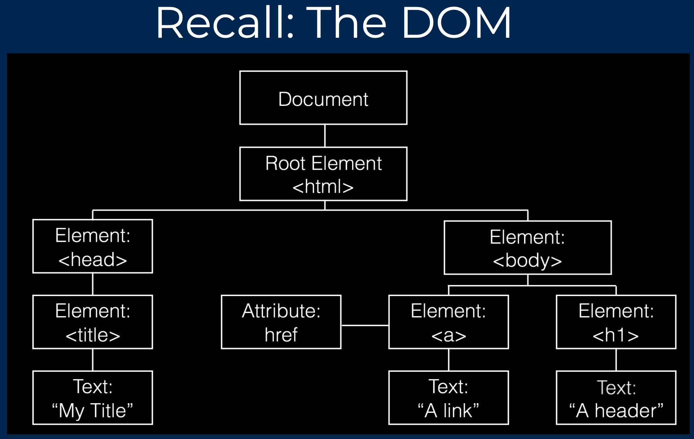

# DOM



- DOM has a tree structure, and is painted to the browser
- The tree is built first, and then properly painted onto the browser
- Any time we want to edit the DOM, it has to go through a process

Manipulaing DOM can be very complicated if we do it manually.

Instead, frameworks like React, Vue, and Angular have an extra layer to their DOM manipulation system

# The Virtual DOM

- An *in-memory* representation of the DOM
- Changes to the virtual DOM don’t need to go through the process of painting on the browser, so saves resources
- This means we can create completely new DOM trees very quickly

When rendering a component, a virtual DOM tree is quickly made in memory

```jsx
render (
	<div>
  	<h1>{ this.state.title }</h1>
    <h3>{ this.state.subtitle }</h3>
  </div>
)
```

React will then take the Virtual DOM tree and figure out an efficient way of painting the elements in the browser

- A*reconciliation*algorithm 

## Reconciliation

- Smart algorithm for finding differences
- Attempts to only change child DOM nodes that are needed
- Helped by things like *keys* that we add to lists

## Transpiling

- We saw a lot of new syntax
- Much of it is converted to the JavaScript we’ve seen before through the help of a conversion tool called a **transpiler**
- For example, `Babel`


