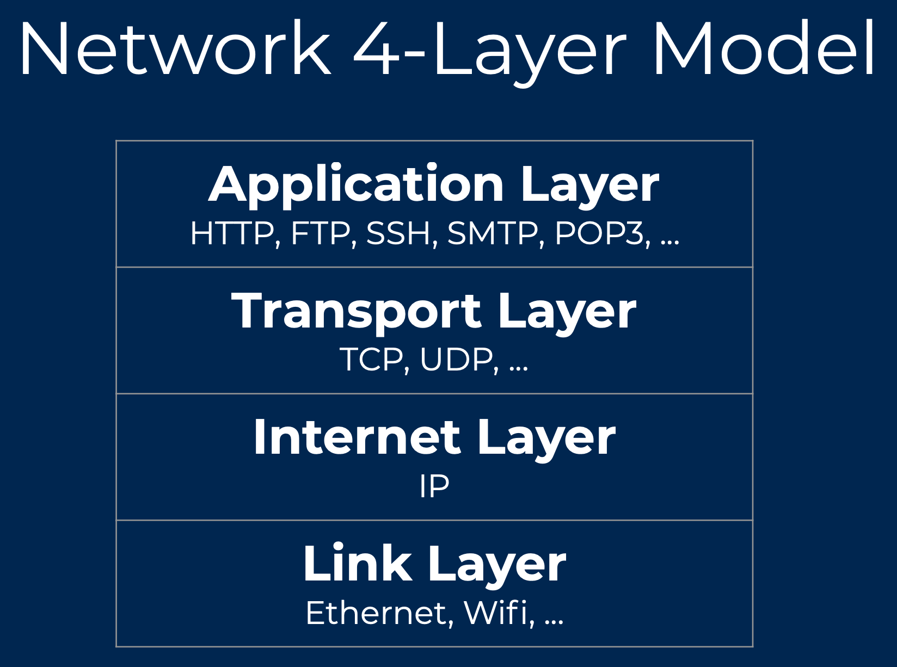
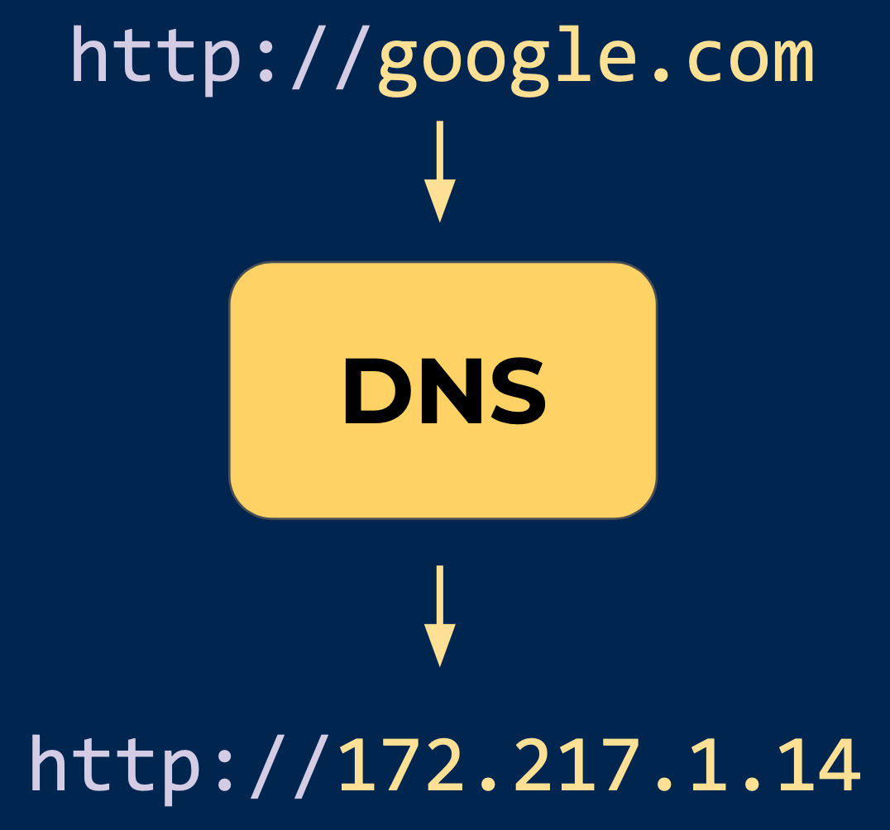
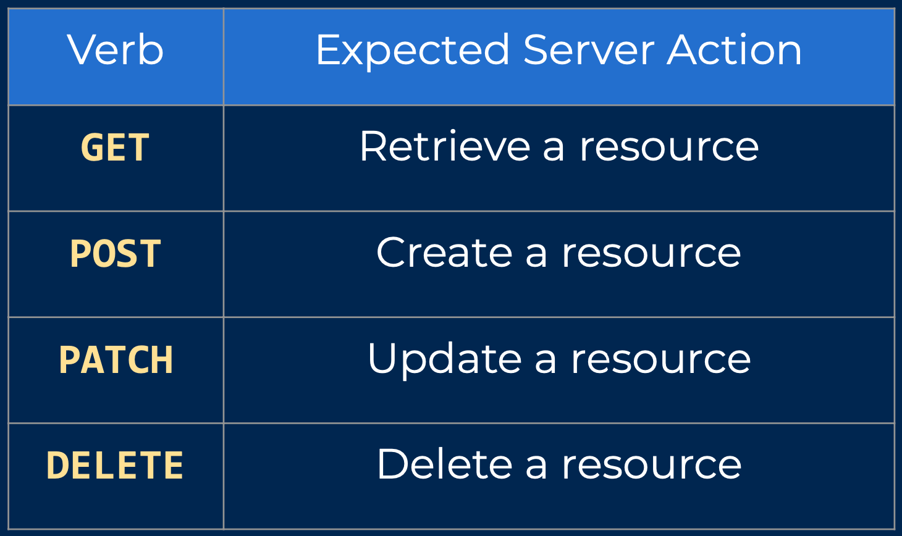
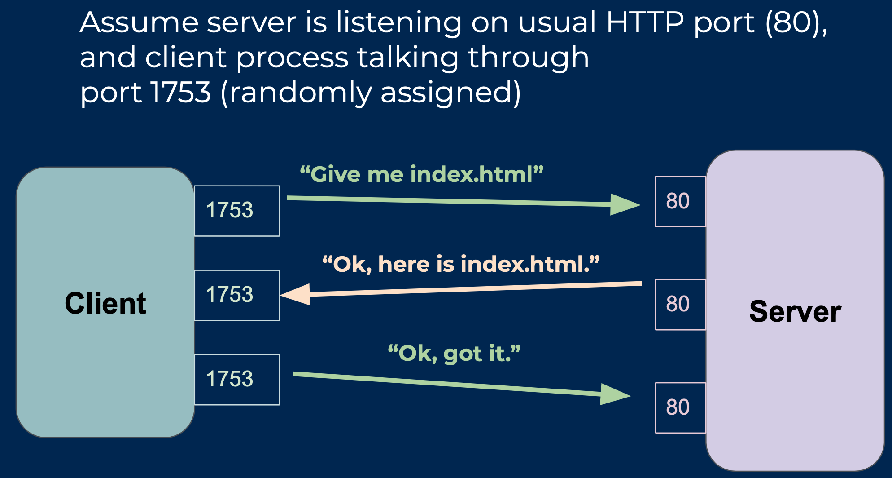
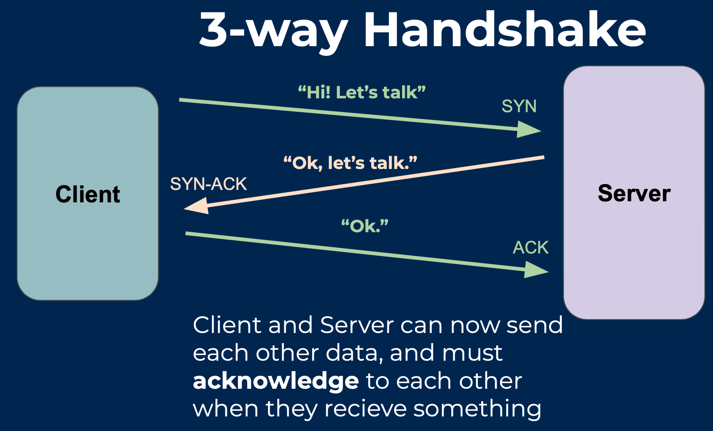

# Web

## What is the Web?

- A **global collection** of resources... 

  - A **web resource** can be any data we can send through the internet
    - Text, images, video, audio, etc.
  - **Global** - want to access these resources no matter where they are in the world
  - Where are they stored?
    - On “web” servers - Computers with resources that are accessible

- ..which are **identifiable**...

  - We need a way to **get these resources** from their web servers

    - Necessary that we can **locate** where they are in the entire web
    - Need a **consistent** way to identify and access each resource

    ***Uniform Resource Locator (URL)***

- ...and **linked** together.

  - The web is...a web, after all!
  - Resources link to other resources
    - Allows us to easily discover the web
  - Those that are similar tend to link to each other

- A **global collection** of resources which are **identifiable** and **linked** together.

## Client-Server

- Client initiates request to server 
- Server accepts or rejects connection 
- If a connection is established, data can flow until connection terminates

## Network 4-Layer Model

### Application Layer

Provides applications with standardized **protocols** to exchange data

- Example: Web browsers need a protocol to get and send data

Protocols include: HTTP, FTP, SSH, SMTP, POP3...

#### HTTP

- HyperText Transfer Protocol (HTTP)

- The protocol of the web 

- Gives the client and server a mutual language at the application layer

- Global collection of resources

  - **All machines** can use HTTP through applications - global reach

- Hostnames translated to IP addresses by the Domain Name System (DNS)
- IP address can change, name can stay the name

- **HTTP** works by request-response

  - Request from client 
  - Response from server 

- HTTP Request includes... 

  - **URL**
    - To get to the resource on the server we want 
  - HTTP **Method**
    - To tell the server what we want to do with that resource 
  - Request **Headers** and **Body**
    - Give the server additional information about our request

- **HTTP Method**

  - HTTP Methods are verbs that are used to label the actions we expect a server to take
  - 
  - Response code
    - Gives us standard indicator of the overall status of the response
  - Headers
    - Give information about the response
  - Body
    - The content of the resource, if available

- HTTP (HyperText Transfer Protocol): Linking together

  - Text/resources with **"hyperlinks"** - links to 

    other resources 

  - Similar resources are often linked together

  - This is what gives us the feeling of a **connected** web 

- Ports

  - What if there are multiple processes that want to listen for connections?
  - Every process on a computer that uses the internet is assigned a port
    - TCP or UDP port
  - Server process that listens for **HTTP** requests usually uses port **80**
  - 

- HTTP: Stateless protocol

  - Each request is independent, 
    - Server doesn’t need to keep track of previous requests
    - Doesn’t care how many are sent at once
  - This simplifies the protocol
  - Illusion of state (e.g. knowing which pages the user browsed) can still occur, but is not part of the protocol (state info can be store in database, or cookie, but not the protocol)

### Transport Layer

- Provides **host-to-host** communication services
  - “Connection-oriented”
  - Sends segments of data from the application layer (packets)
- Transport protocol for TCP/IP is **TCP**
- Other transport protocols include **UDP**

#### TCP

- Recall: **Connection-oriented**

  - Needs to have a pre-arranged connection before sending data 

  - Should be **bi-directional**

  - Both client and server should **acknowledge** when they get data

##### Acknowledgements

- An important part of TCP because...
  - Can check packet is from correct host
  - Losing packets is a real problem
- If no acknowledgment that packet was received...
  - Packet sent again
- TCP is **reliable**
  - But reacts to losing packets by slowing connection
  - **UDP** is not reliable, but doesn’t react to packet loss

### Internet Layer

- Provides protocols for sending **packets** across a **network** or through multiple networks
- The **Internet Protocol (IP)** handles this in TCP/IP
  - *Routes* data across networks using IP addresses

#### IP protocol

- **"Connection-less"** protocol: No prearranged connection required to send data 

- **IP** just sends packets over networks 

  - no assurance that they will be delivered 

  - no way to find out if they were 

  - nothing to let the destination know to expect a packet

  - doesn’t do much of anything really.. 

#### IP packets

- Easy to **'spoof'** packets

  - Connectionless protocol means you can send around packets that pretend they came from a specific IP address

  - Defense against this can come from higher network layers, or from network monitoring

### Link Layer

- Protocols of the **physical link** between the nodes of the network
  - Ethernet, WiFi, DSL 
- Lowest level
  - TCP/IP can sit on top of any Link layer

​    

​    

