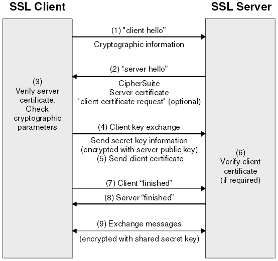
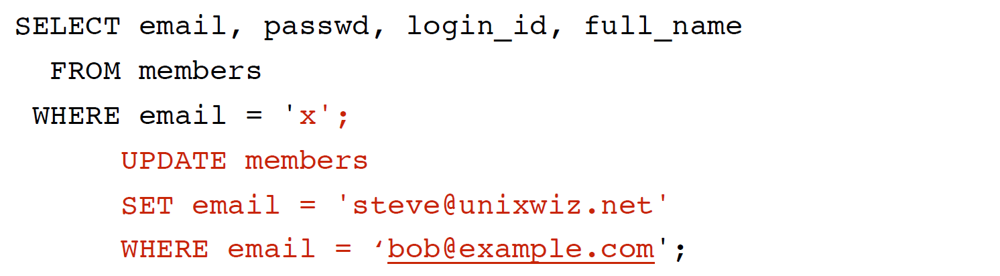
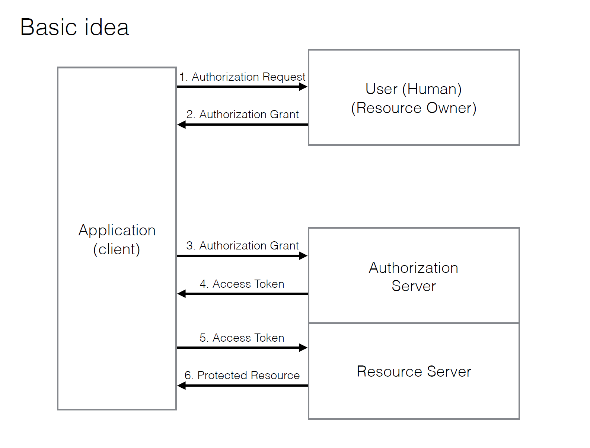

# Web Security

## Goals

Confidentiality

- the correct people have access to information

Integrity

- the information is reliable

Availability

- users can accomplish their tasks

## All sort of attacks

Directly on your system

- stealing data, passwords, credit card numbers
- defacing, denial of service, link spam

On your users

- Cross Site Scripting (XSS), Request Forgery (CSRF), Man-In-The-Middle
  (MITM), profiling

Both

- Hosting bad content / “drive-by download”

Neither

- Ad-based malware


## Transport Layer Security (TLS)

Security mechanism underlying HTTPS

Often still called SSL, but the older SSL protocol versions are obsolete and broken

Client and Server use public-key encryption to agree on a shared pre-session secret, then use that secret to encrypt session data.



### OWASP Top 10

1. Injection
2. Broken Authentication and Session Management
3. Cross Site Scripting (XSS)
4. Insecure Direct Object References
5. Security Misconfiguration
6. Sensitive Data Exposure
7. Missing function level access control
8. Cross Site Request Forgery (CSRF)
9. Using Components with Known Vulnerabilities
10. Unvalidated Redirects and Forwards


1. **Injection**

   User inputs data that you want to store in the database

   You insert that data into an SQL query

   ```sql
   String query = "SELECT * FROM accounts WHERE
   custID='" + request.getParameter("id") + “‘";
   
   foo' or 'x'='x
   
   String query = "SELECT * FROM accounts WHERE
   custID=' foo' or 'x'='x '";
   ```

   returns all customer information

   

   ### Prevention

   - Use parameterized queries
   - Escape everything
   - Validate input
   - Never trust raw input

2. **Auth and Sessions**

   Vulnerabilities
   - User credentials not stored using hashing or encryption
   - Credentials can be guessed or overwritten
   - Session IDs exposed in URL
   - Session IDs don’t time out
   - Authentication tokens (single sign-on) not properly
   invalidated on log out
   - Passwords, session IDs sent over unencrypted
   connections

   **OAuth**

   - Authorization framework that delegates user authentication to a service that hosts the user account
   - Must register app with the auth service, including the URL to redirect to
   - Auth service redirects to a registered URL with an authorization code (using HTTPS of course)

   

3. **Cross-Site Scripting**

   Data enters web application and is included in dynamic content sent to a web user without being validated for malicious content.

   Usually JavaScript but may also include HTML and other data.

   Three types:

   1. Stored
      - Injected script is stored permanently on server
      - victim retrieves script from server through normal requests
      - e.g. input中传一个``<script> alert('U R Hacked') </script>``, user may retrieve such malicious code and get error.
      - e.g. `<strong>something</strong>` is passed in as input, when this displays, it's gonna be rendered as html element, things much worse than this could happen
   2. Reflected
   3. DOM-based

   Escape all untrusted data

   There is some sanitizer package for html input, which filters out all suspicious input.

4. **Insecure Direct Object Reference**

   - Attacker is an authorized user
   - Attacker can gain access to objects by guessing parameters
   - `http://example.com/app/accountInfo?acct=notmyacct`

   Prevention: ensure user is authorized for access

5. **Security misconfiguration**

   1. Is any of your software out of date? This includes the OS, Web/App Server, DBMS, applications, and all code libraries (see new A9).
   2. Are any unnecessary features enabled or installed (e.g., ports, services, pages, accounts, privileges)?
   3. Are default accounts and their passwords still enabled and unchanged?
   4. Does your error handling reveal stack traces or other overly informative error messages to users?
   5. Are the security settings in your development frameworks (e.g., Struts, Spring, ASP.NET) and libraries not set to secure values?
   6. Without a concerted, repeatable application security configuration process, systems are at a higher risk.

6. **Sensitive Data Exposure** (敏感信息在传输过程中没有加密)

   Which data is sensitive enough to require extra protection?

   - passwords
   - credit cards
   - personal information

   Is any of this data ever transmitted in clear text? May be retrieved and easily understood.

   Encrypt all sensitive data.

   

   **Examples**

   1. Ex1:

      - Automatic database encryption of passwords

      - This means it is also automatically decrypted

      - Passwords still vulnerable to SQL injection attack

   2. Ex2:

      - Application doesn’t use TLS for all authenticated pages
      - Network packet snooping can read session cookies
      - Replay session cookies to hijack users’ session

   

7. Missing Function Level Access Control (检查是否authorized)
  
  
   - Modifies URL, changes parameter and gets access to data attacker is not authorized for
   - Often URL in frameworks refers directly to objects
     - Internal ids appear in URLs (REST)
   - Check access authorization on every object
   - Not sufficient to simply not show privileged operations to unprivileged users in the UI (在UI中不显示button/选项是不够的，request可以通过很多种方式发送，server端也必须要有检查)

8. Cross-Site Request Forgery (虚假网站)
   - Some content on unrelated site includes a POST to your application
   - If a user of your app navigates to compromised site while logged into your app, the malicious POST request can pretend to be the user, and steal the user’s info from your app
   - e.g. 虚假网站上一比一模拟了一个银行的网页，网址/域名只有一个字母的差别，诱导用户输入账户密码后，信息被发送给真正的网站的server并被redirect到真正的网站，用户将什么都察觉不到，但是黑客将能够获取到用户输入的账户密码。
   - Prevention: Include an unpredictable token with each HTTP request (usually in a hidden field)

9. Using components with know security vulnerabilities

   - Development teams and Dev Ops people must be vigilant
   - Be careful what you include in your application
   - Update software always

10. Unvalidated Redirects and Forwards

    - Apps use redirects or internal forwards where unvalidated parameters are used

    Example：`http://www.example.com/redirect.jsp?url=evil.com`

    比如黑客事先填好param里的东西，将网址发给用户，用户点开后可能会被redirect到黑客想让他去的地方，或者显示黑客想让他看见的东西。


