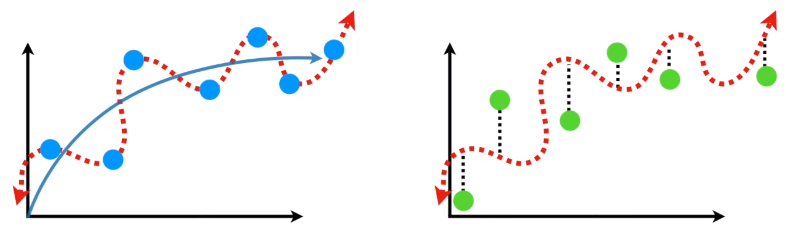
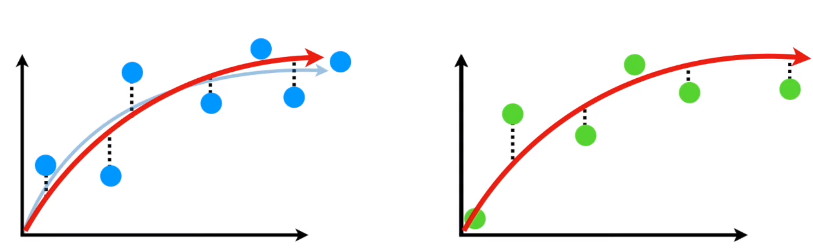
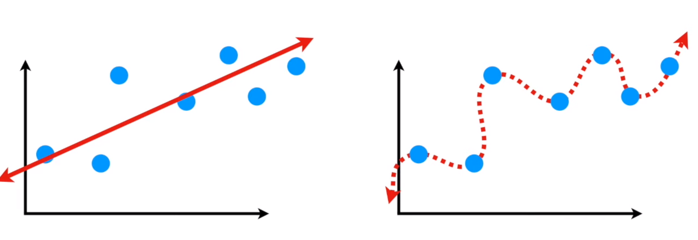
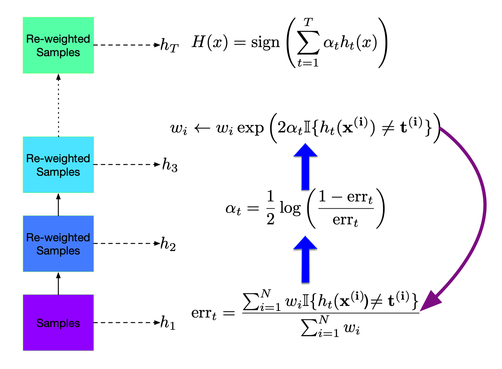
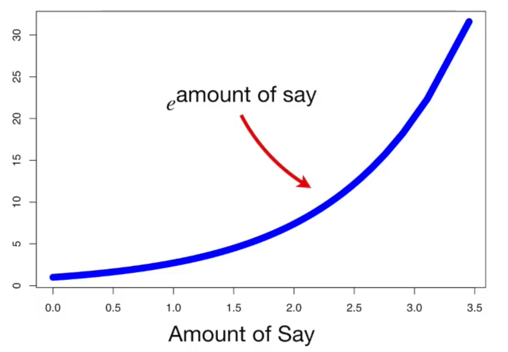
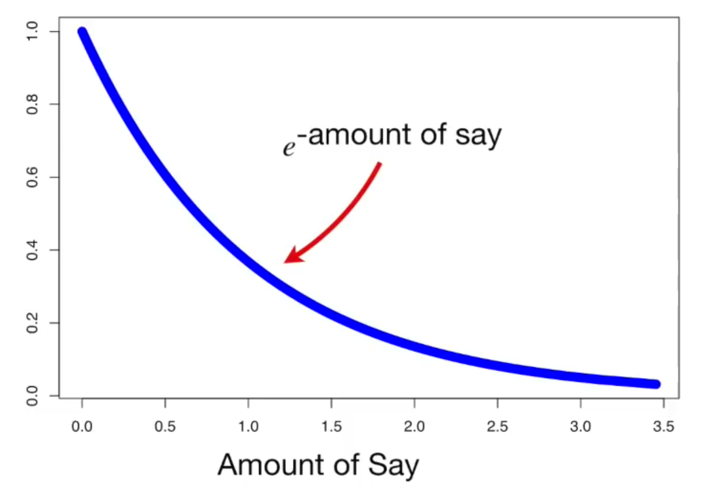

# Final Review

## Bias Variance Tradeoff

https://www.youtube.com/watch?v=EuBBz3bI-aA

> The inability for a machine learning method (like linear regression) to capture the true relationship is called **bias**

A straight line might not work well as a classifier, it can't be curved to capture some "true" relationship. Thus it has a relatively large amount of bias.

Bias can be measured by least squared distance (residuals).

Straight line doesn't work well, what if we overfit a training dataset so that there is no RSS (residual sum of square) at all. Fitting perfectly to the training data.

Blue dots are training data, green dots are testing data. The classifier works perfectly for the traning set but not the testing set. A straight line could even be better than the squiggly line classifier.

### Conclusion

In machine learning, the ideal algorithm has **low bias** and can accurately model the true relationship. In addition, it should have **low variability**, by producing consistent predictions across different dataset.

The classifier should work with consistent performance, well on both traning and testing sets.

We find such a classifier by finding the sweet spot between a simple model and a complex model.

### Solutions

Three commonly used methods for finding the sweet spot between simple and complicated models are:

- regularization
- boosting
- bagging

Ensembles combine classifiers to improve performance

### Bagging

- Reduces variance (large ensemble can’t cause overfitting)
- Bias is not changed
- Parallel
- Want to minimize correlation between ensemble elements.

### Boosting

- Reduces bias
- Increases variance (large ensemble can cause overfitting)
- Sequential
- High dependency between ensemble elements

------

## Ada Boost

https://www.youtube.com/watch?v=LsK-xG1cLYA

**3 Main ideas:**

1. AdaBoost combines a lot of "weak learners" to make classifications. The weak learners are almost always **stumps**.
2. Some stumps get more say in the classification than others.
3. Each stump is made by taking the previous stump's mistakes into account, so order of stumps matters.

**Procedures**

1. At each iteration we re-weight the training samples by assigning larger weights to samples (i.e., data points) that were classified incorrectly.
2. We train a new weak classifier based on the re-weighted samples.
3. We add this weak classifier to the ensemble of weak classifiers. This ensemble is our new classifier.
4. We repeat the process many times.

#### AdaBoost reduces bias by making each classifier focus on previous mistakes.

AdaBoost’s training error (loss) converges to zero.

If one runs AdaBoost long enough, it can in fact overfit. Generally, it doesn’t.

$\text{Amount of Say}=\frac{1}{2}\log(\frac{1-Total Error}{Total Error})$

#### Update Sample Weight (increase)

- $\text{New Sample Weight} = \text{sample weight}\times e^{\text{amount of say}}$

Since $e^x\geq1,\forall x\in[0, \infty]$, no matter how small the **amount of say** is, the new sample weight will be larger than the previous one. But greater amount of say leads to greater "new sample weight".

#### Decrease Sample Weights for all correctly classified samples.

- $\text{New Sample Weight}=\text{sample weight}\times e^{\text{-amount of say}}$

When amount of say is large, $e^{-\text{amount of say}}$ is close to 0, new sample weight will be very small.

If amount of say is small, $e^{-\text{amount of say}}$ is close to 1, new sample weight will be just a little smaller than the old one.

**Ensemble:**

1. Bagging: reduce variance
2. Boosting: reduce bias
3. random forest: reduce correlation

