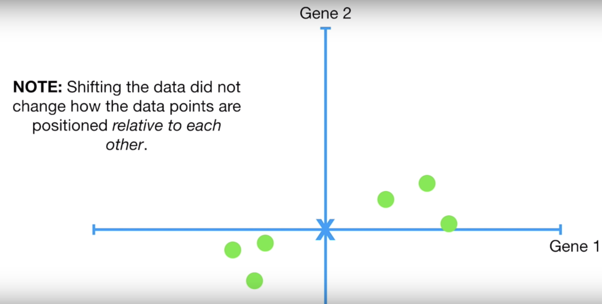
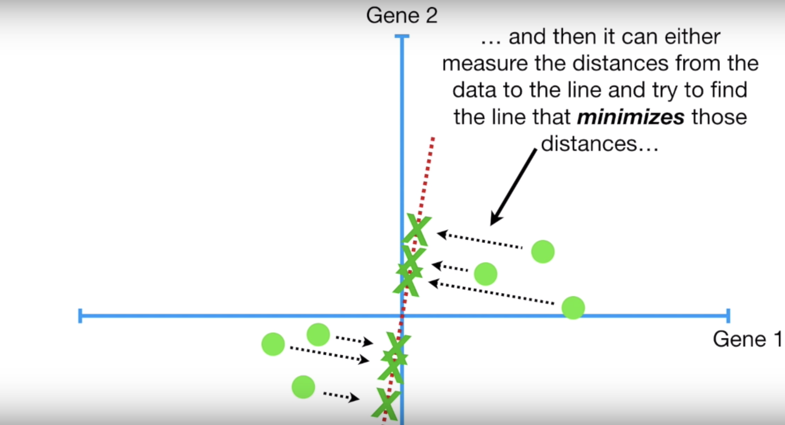
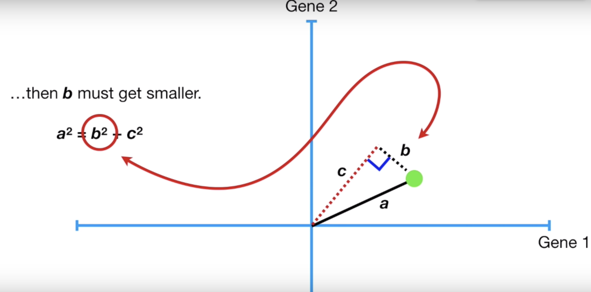

# PCA

https://www.youtube.com/watch?v=FgakZw6K1QQ

**Goal:** Clustering, unsupervised learning.

**Idea:** Transform from high dimension to low dimension (2D)

In 2D, calculate the mean of all data points, shift the entire data set so that the mean (center) is at the origin (0, 0).

Fit a line among the data points.

Find the line that minimizes those distances.

Equivalently, find the line that maximizes the distances from the projected points to the origin.

Why?

$a$ doesn't change. $b$ is the distance to the fitted line, c is the distance from the origin to the projected point of $b$ onto the fitted line.

As $b$ increases, $c$ must decrese, and vice versa, since $a$ is constant.

Thus, minimizing the sum of all $b's$ is the same as maximizing the sum of all $c's$.

