# File System

## Extent-Based File System

An extent == a disk pointer plus a length (in # of blocks), i.e., it allocates a few blocks in a row. 

Instead of requiring a pointer to every block of a file, we just need a pointer to every extent (group of blocks).

**Disadvantage:** Less flexible than the pointer-based approach.  (External fragmentation?)

**Advantages:** Uses smaller amount of metadata per file, and file allocation is more compact.

Adopted by ext4, HFS+, NTFS, XFS.

## Link-Based File System

Instead of pointers to all blocks, the inode just has one pointer to the first data block of the file, then the first block points to the second block, etc.

Works poorly if we want to access the last block of a big file.

Use an in-memory File Allocation Table, indexed by address of data block 

FAT file system, used by Windows before NTFS. 

## Summary

### Inodes 

- Data structure representing a FS object (file, dir, etc.)
- Attributes, disk block locations
- No file name, just metadata!

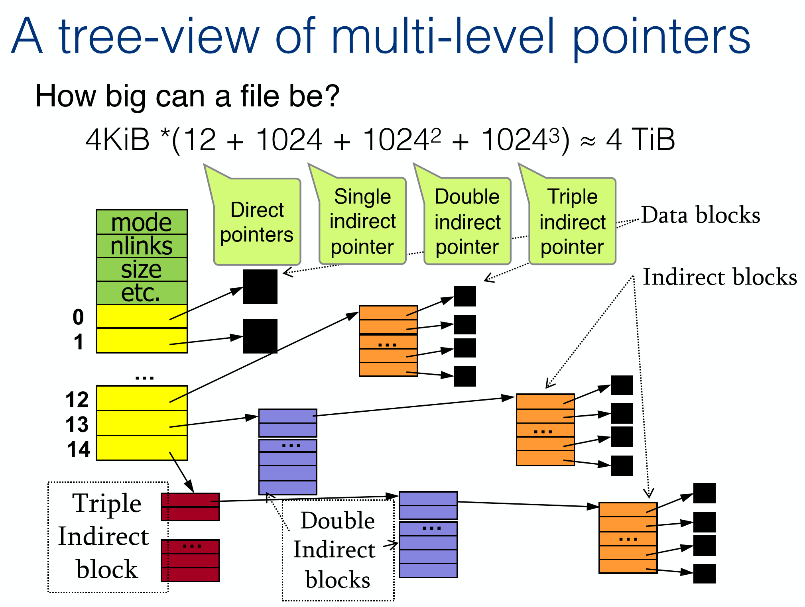

An Inode stores 15 pieces of address pointing to data blocks. The first 12 are direct pointers to data blocks. The 13th is a single indirect pointer, the 14th is a double indirect pointer, the 15th is a triple indirect pointer.

Each indirect pointer points to another block of pointers. 4KB = 1024 pointers to 1024 data blocks. 

### Directory

- List of (name, inode) mappings (an entry)
- Each directory entry: a file, other directory, link, itself (.), parent dir (..), etc.

## Journaling

### File System Reliability

**Goal:** Ensure that the file system is in a consistent state in the event of an operating system failure. 

**Consistent state:** It either looks like a file operation never occurred, or looks like it completed. 

#### Approaches

Do nothing and try to recover in the event of a crash

- Choose a good order for operations to minimize data loss
- Most older file systems took this approach (ext2, ffs) 

Treat each file system operation as a transaction

- Roll-back if transaction didn’t complete

#### Crash Recovery

When the file system comes back up, run a program to scan the file system structure and restore consistency.

##### fsck (file system consistency check)

- All data blocks pointed to by inodes (and indirect blocks) must be marked allocated in the data bitmap 
- All allocated inodes must be in some directory entry 
- Inode link count must match directory entries 

Can’t detect if data block did not get written. 

Only verifies if metadata is consistent

###### What does fsck check?

1. Superblock: sanity checks   
- Use another superblock copy if suspected corruption 
2. Free blocks: scan inodes (incl. all indirect blocks), build bitmap 
- inodes / data bitmaps inconsistency => resolve by trusting inodes 
- Ensure inodes in use are marked in inode bitmaps   
3. Inode state: check inode fields for possible corruption 
- e.g., must have a valid "mode" field (file, dir, link, etc.)  
- If cannot fix => remove inode and update inode bitmap 
4. Inode links: verify links# for each inode 
- Traverse directory tree, compute expected links#, fix if needed 
- If inode discovered, but no dir refers to it => move to "lost+found"

5. Duplicates: check if two different inodes refer to same block 
- Clear one if obviously bad, or, give each inode its own copy of block 
6. Bad blocks: bad pointers (outside of valid range) 
- Just remove the pointer from the inode or indirect block 
7. Directory checks: integrity of directory structure 

- E.g., make sure that "." and ".." are the first entries, each inode in a directory entry is allocated, no directory is linked more than once

###### fsck limitations

- So, fsck helps ensure integrity
- Only FS integrity, cannot do anything about lost data!
- Bigger problem:  too slow!
  - Disks are very large nowadays – scanning all this could take hours!
  - Even for small inconsistency, must scan whole disk!

#### Alternative solution: Journaling 

- Aka Write-Ahead-Logging
- Basic idea: 
  - Write a log on disk of the operation you are about to do, before making changes
  - If a crash takes place during the actual write => go back to journal and retry the actual writes.
    - Don’t need to scan the entire disk, we know what to do!
    - Can recover data as well
  - If a crash happens before journal write finishes, then it doesn’t matter since the actual write has NOT happened at all, so nothing is inconsistent.

### Linux Ext3 File System

Extends ext2 with journaling capabilities

Backwards and forwards compatible

- Identical on-disk format 

Journal can be just another large file (inode, indirect blocks, data blocks)

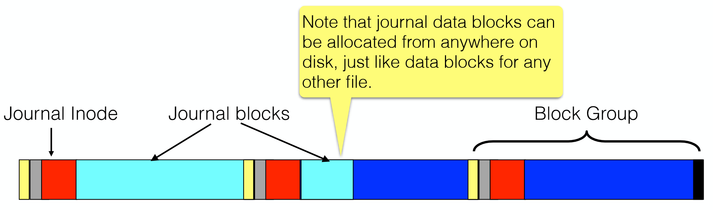

### What goes in the "log"

#### Transaction structure: 

- Starts with a "transaction begin" (TxBegin) block, containing a transaction ID 
- Followed by blocks with the content to be written  
  - Physical logging: log exact physical content 
  - Logical logging: log more compact logical representation 
- Ends with a "transaction end" (TxEnd) block, containing the corresponding TID

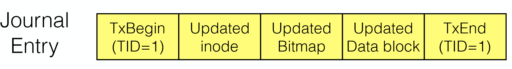

### Data Journaling Example

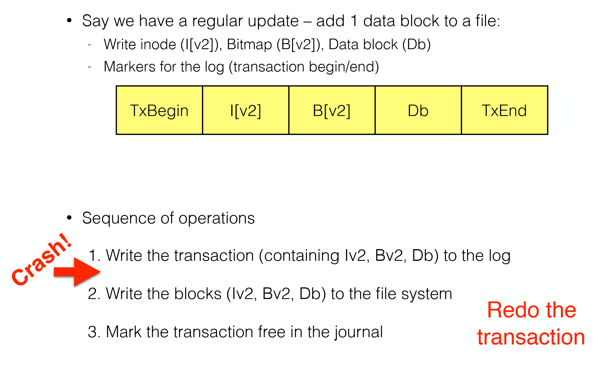

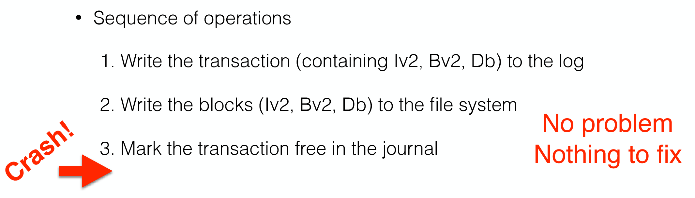

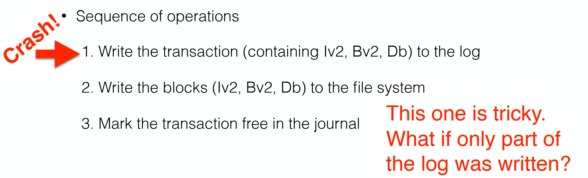

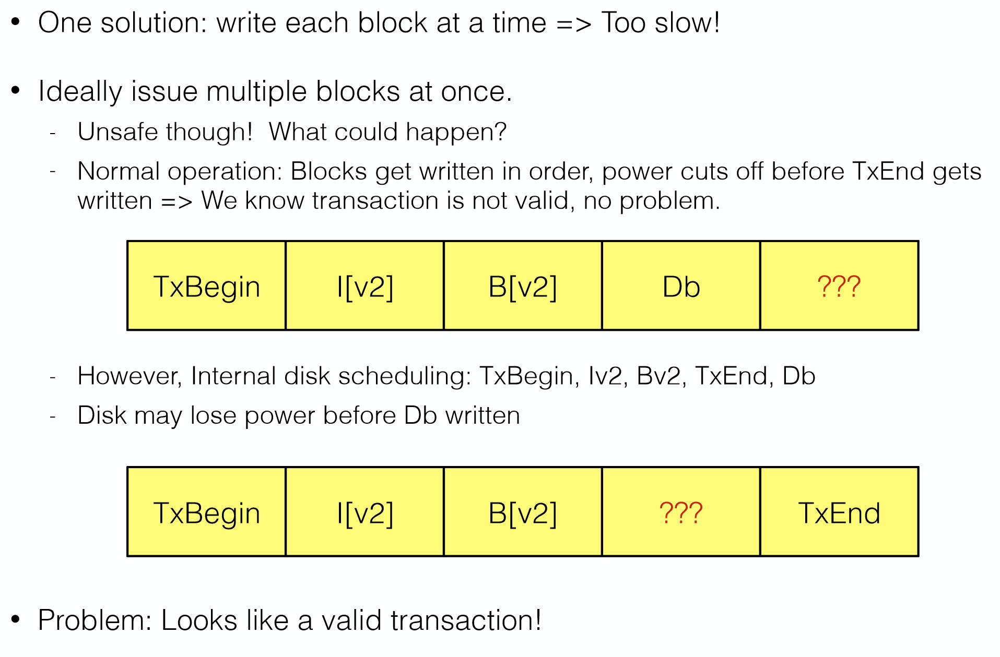

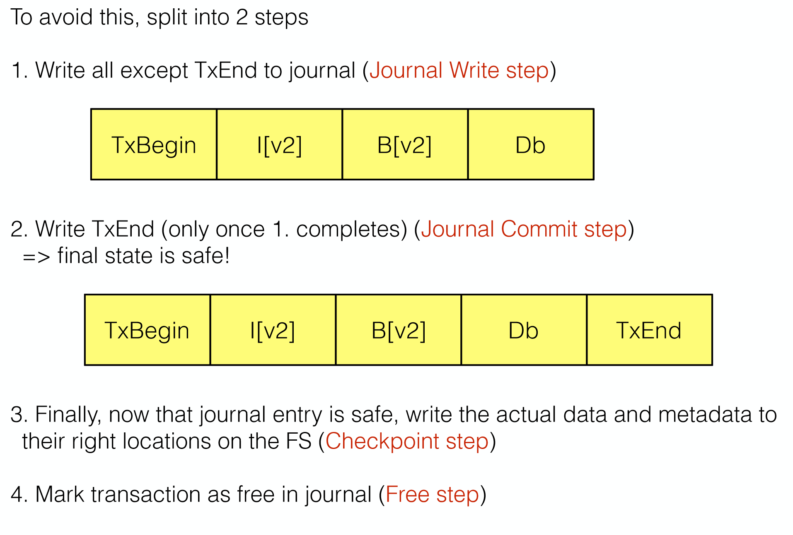

### Journaling: Recovery Summary

If crash happens before the transaction is committed to the journal (TxEnd not written yet)

- Just skip the pending update 

If crash happens during the **checkpoint** step (writing data to data blocks)

- After reboot, scan the journal and look for committed transactions 
- Replay these transactions 
- After replay, the FS is guaranteed to be consistent 
- Called **redo logging**

### Journal Space Requirements 

How much space do we need for the journal? 

- For every update, we log to the journal => sounds like it’s huge!

After "checkpoint" step, the transaction is not needed anymore because metadata and data made it safely to disk  

- So the space can be freed (free step).

In practice: **circular log**

### Metadata Journaling 

Recovery is much faster with journaling 

- Replay only a few transactions instead of checking the whole disk

However, normal operations are slower

- Every update must write to the journal first, then do the update 

  - Writing time is at least doubled 

- Journal writing may break sequential writing. Why?

  - Jump back-and-forth between writes to journal and writes to main region

- Metadata journaling is similar, except we only write FS metadata (no actual data) to the journal:

  

#### What can happen now?

- Say we write data after checkpointing metadata 
- If crash occurs before all data is written, inodes will point to garbage data! 
- How do we take care of this?

#### Solution

**Write data BEFORE writing metadata to journal!**

1. Write data, wait until it completes 
2. Metadata journal write 
3. Metadata journal commit 
4. Checkpoint metadata 	(write actual meta data to inode)
5. Free

If write data fails => as if nothing happened (bitmap not written), sort of (from the FS’s point of view)!

If write metadata fails => same!

### Summary

- Journaling ensures file system consistency 
- Complexity is in the size of the journal, not the size of the disk! 
- Is fsck useless then?  
- Metadata journaling is the most commonly used 
  - Reduces the amount of traffic to the journal, and provides reasonable consistency guarantees at the same time. 
- Widely adopted in most modern file systems (ext3, ext4, ReiserFS, JFS, XFS, NTFS, etc.)

## Redundency (RAID)

Journaling helps recover from a crash during a write, by replaying the log entries of the write operations,  assuming that the disk is still usable after rebooting.

What if we have disk failures? 

What can we do to prevent data loss?

- Have more than one copies of the data: Redundancy!

### RAID

Redundant Array of ~~Inexpensive~~ Independent Disks (RAID)

#### Reliability strategies: 

- Data duplicated – mirror images, redundant full copy => one disk fails, we have the mirror  
- Data spread out across multiple disks with redundancy => Can recover from a disk failure, by reconstructing the data 

#### Concepts

- Redundancy/Mirroring: keep multiple copies of the same block on different drives, just in case a drive fails 
- Parity information: XOR each bit from 2 drives, store checksum on 3rd drive

#### Some Standard RAID Levels

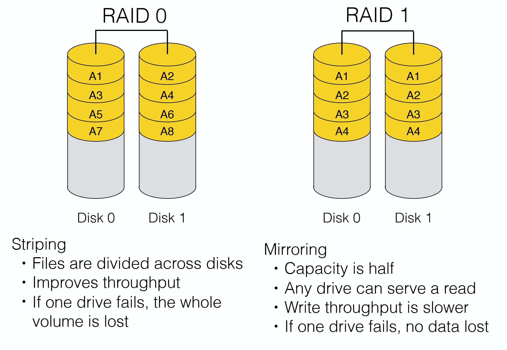

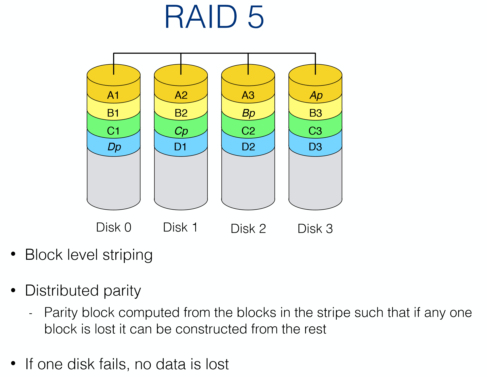

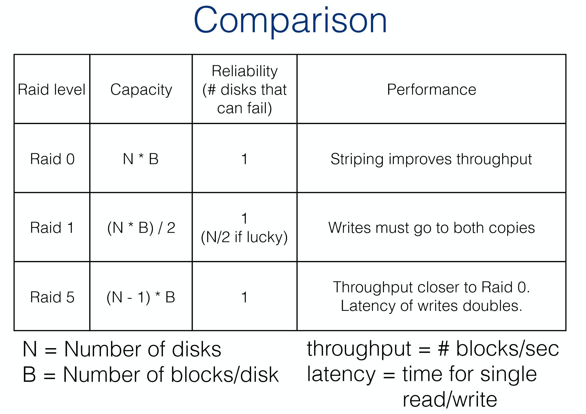

## SSD (Solid State Disks)

Replace rotating mechanical disks with non-volatile memory

- Battery-backed RAM 
- NAND flash 

**Advantages:** faster

**Disadvantages:**  

- Expensive 
- Wear-out (flash-based) 

NAND flash storage technology 

- Read / write / erase! operations

### SSD Characteristics

Data cannot be modified "in place" 

- No overwrite without erase

Terminology: 

- Page (unit of read/write), block (unit of erase operation) 

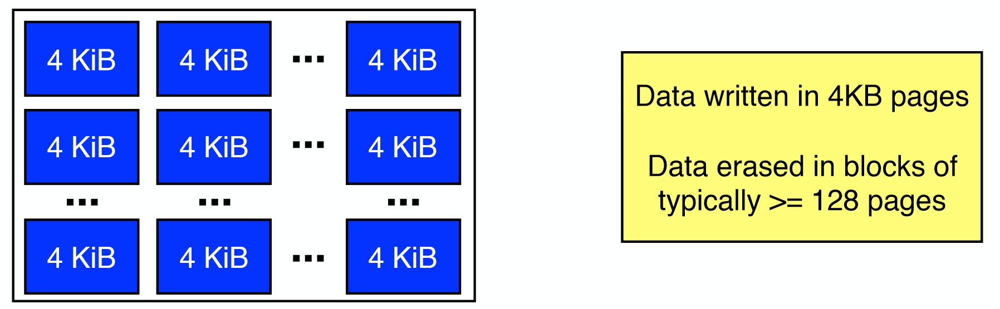

A page is like a block.

**Uniform random access performance!** 

- Disks typically have multiple channels so data can be split (striped) across blocks, speeding access time

### Writing

Consider updating a file system block (e.g. a bitmap allocation block in ext2 file system) 

- Find the block containing the target page 
- Read all active pages in the block into controller memory 
- Update target page with new data in controller memory 
- Erase the block (high voltage to set all bits to 1)
- Write entire block to drive

Some FS blocks are frequently updated

- And SSD blocks wear out (limited erase cycles)

### SSD Algorithms

Wear levelling 

- Always write to new location  
- Keep a map from logical FS block number to current SSD block and page location
- Old versions of logically overwritten pages are "stale"

Garbage collection 

- Reclaiming stale pages and creating empty erased blocks 

RAID 5 (with parity checking) striping across I/O channels to multiple NAND chips

## File Systems and SSDs

Typically, same FSs as for hard disk drives  

- ext4, Btrfs, XFS, JFS and F2FS support SSDs

No need for the FS to take care of wear-leveling

- Done internally by the SSD 
- But the TRIM operation is used to tell the SSD which blocks are no longer in use. (Otherwise a delete operation doesn’t go to disk) 

