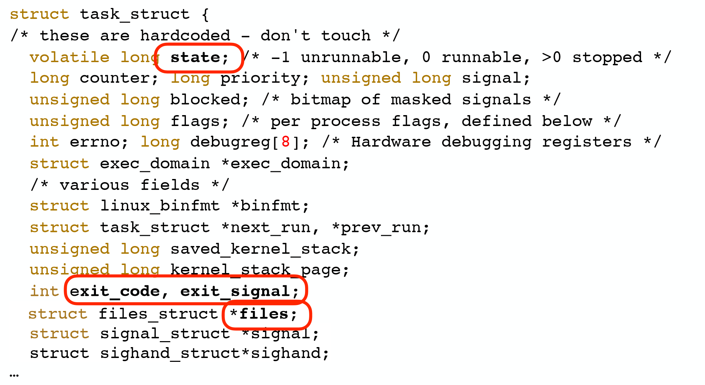
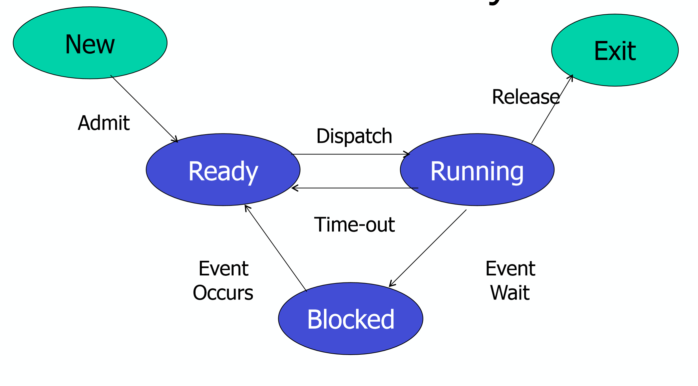
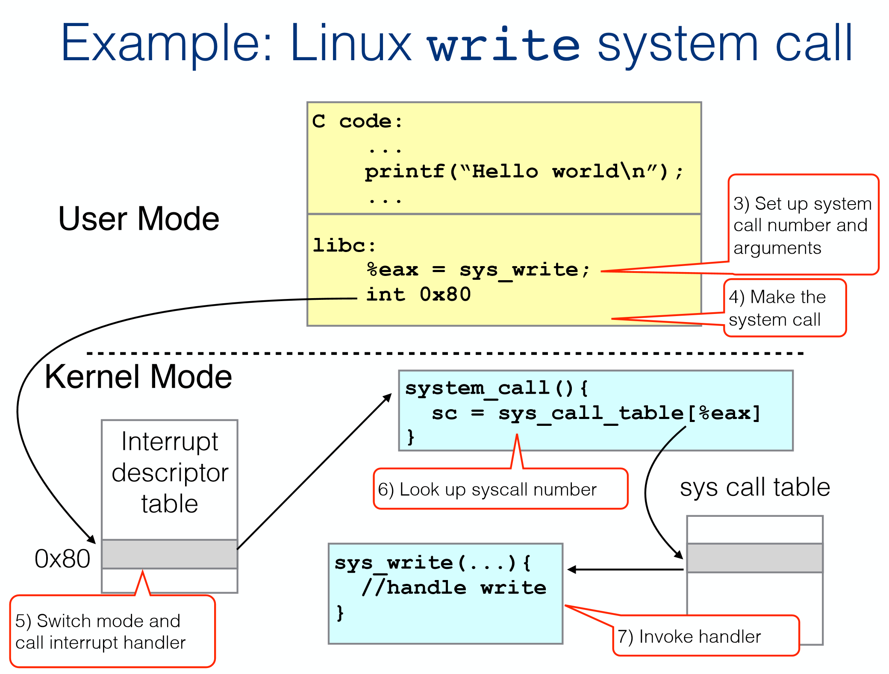
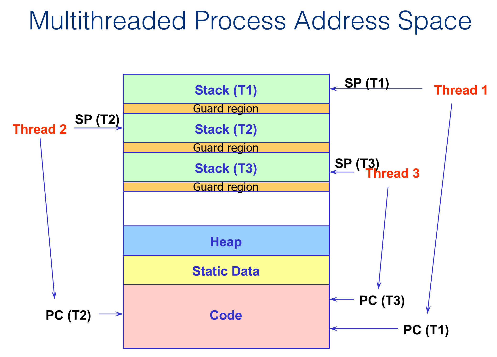

# Process

A process contains all of the state for a program in execution

- An address space 
- The code + data for the executing program 
- An execution stack encapsulating the state of procedure calls 
- The program counter (PC) indicating the next instruction 
- A set of general-purpose registers with current values 
- A set of operating system resources 
  - Open files, network connections, signals, etc. 

A process is named using its process ID (PID)

## Linux Process Control Block (PCB)

Stores state and data of a process.

## Process Life Cycle

## Keeping track of processes

- OS maintains a collection of state queues that represent the state of all processes in the system
- Typically one queue for each state (ready, waiting for event X)
- **As a process changes state, its PCB is unlinked from one queue and linked into another**

## From Program to Process

1. Create new process 
- Create new PCB, user address space structure 
- Allocate memory
2. Load executable
- Initialize start state for process 
- Change state to "ready"  
3. Dispatch process 

- Change state to "running"

## State Change: Ready to Running

### context switch

switch the CPU to another process by:

- saving the state of the old process
- loading the saved state for the new process 

## Process Creation 

A process is created by another process, Parent is creator, child is created 

In some systems, the parent defines (or donates) resources and privileges for its children

- Unix: Process User ID is inherited – children of your shell execute with your privileges

## System Call

A function call that invokes the operating system

Whenever an application wants to use a resource that the OS manages, it asks permission! 

## Interrupts 

Interrupts signal CPU that a hardware device has an event that needs attention 

Interrupts signal errors or requests for OS intervention (a system call) 

- Often called an “exception” or “trap”

CPU jumps to a pre-defined routine (the interrupt handler) 

## Enforcing Restrictions

Hardware runs in user mode or system mode 

Some instructions are privileged instructions: they can only run in system mode

On a “system call interrupt”, the mode bit is switched to allow privileged instructions to occur

## Privileged instructions 

- Access I/O device 
  - Poll for IO, perform DMA, catch hardware interrupt  
- Manipulate memory management 
  - Set up page tables, load/flush the TLB and CPU caches (we’ll see this later) 
- Configure various “mode bits” 
  - Interrupt priority level, software trap vectors, etc.  
- Call halt instruction 
  - Put CPU into low-power or idle state until next interrupt  
- These are enforced by the CPU hardware itself 
  - Reminder: CPU has at least 2 protection levels: Kernel and user mode 
  - CPU checks current protection level on each instruction!  
  - What happens if user program tries to execute a privileged instruction?

## System Call Operation

A fixed number of arguments can be passed in registers 

- Often pass the address of a user buffer containing data (e.g., for write()) 
- Kernel must copy data from user space into its own buffers 

Result of system call is returned in register EAX

# Thread

Processes can share memory

Parallel Programs are inefficient

## Idea

Separate the address space from the execution state 

Then multiple “threads of execution” can execute in a single address space.

Threads can solve a single problem concurrently and can easily share code, heap, and global variables 

faster to create and destroy

potentially faster context switch times 

Concurrent programming performance gains:

- Overlapping computation and I/O

**A thread is a single control flow through a program** 

A program with multiple control flows is multithreaded 

processes are safer and more secure (each process has its own address space)

a thread crash takes down all other threads 

a thread’s buffer overrun creates security problem for all 

