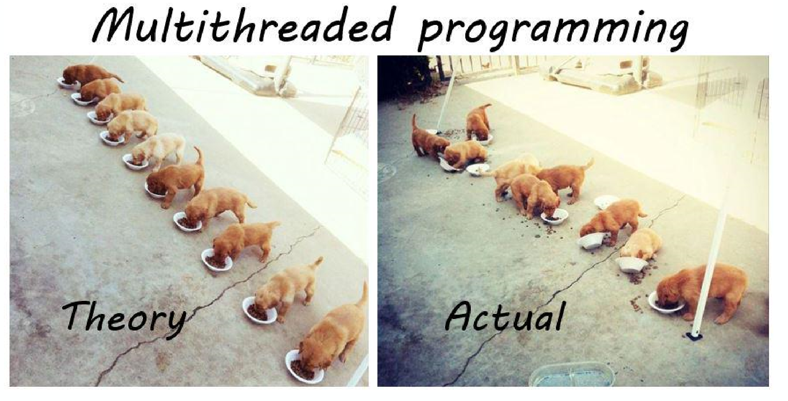
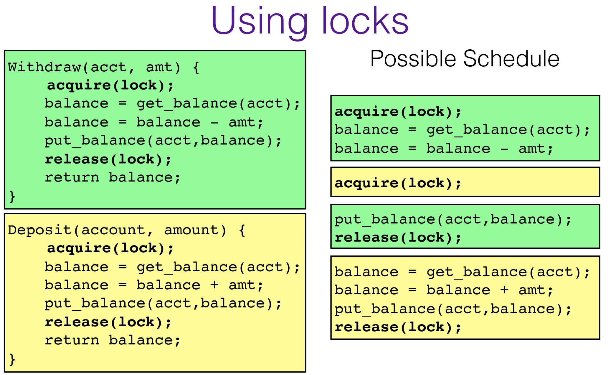
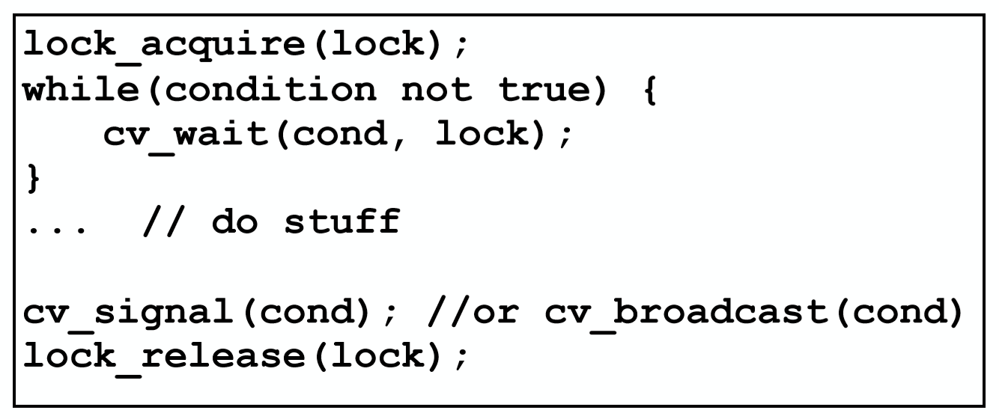
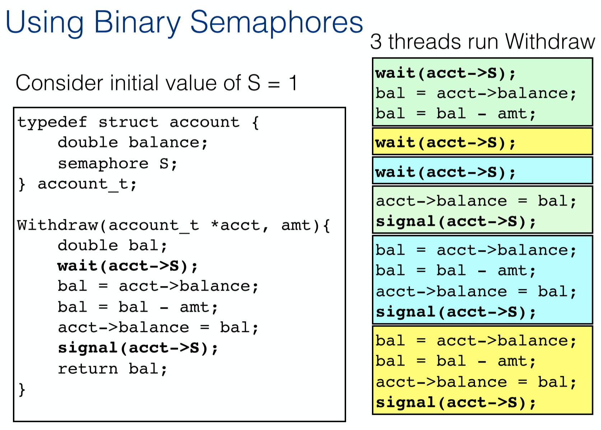
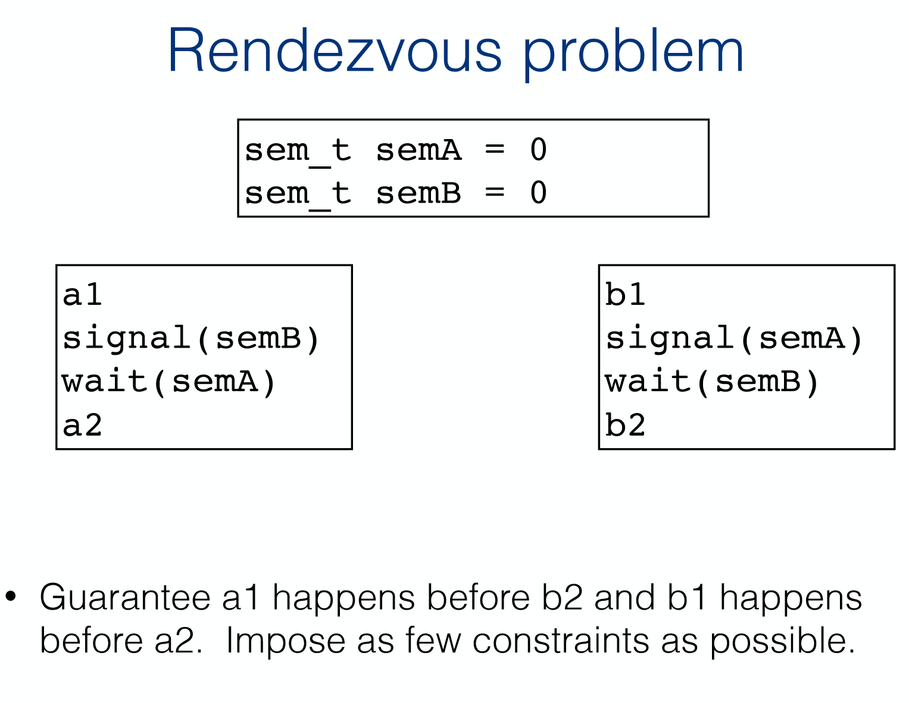
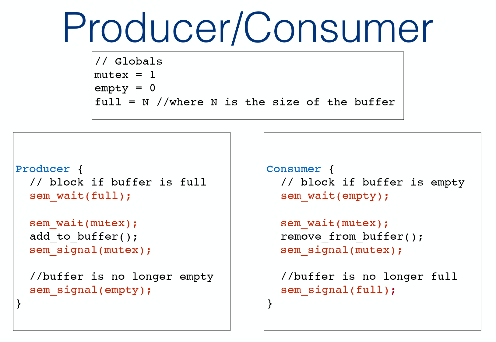
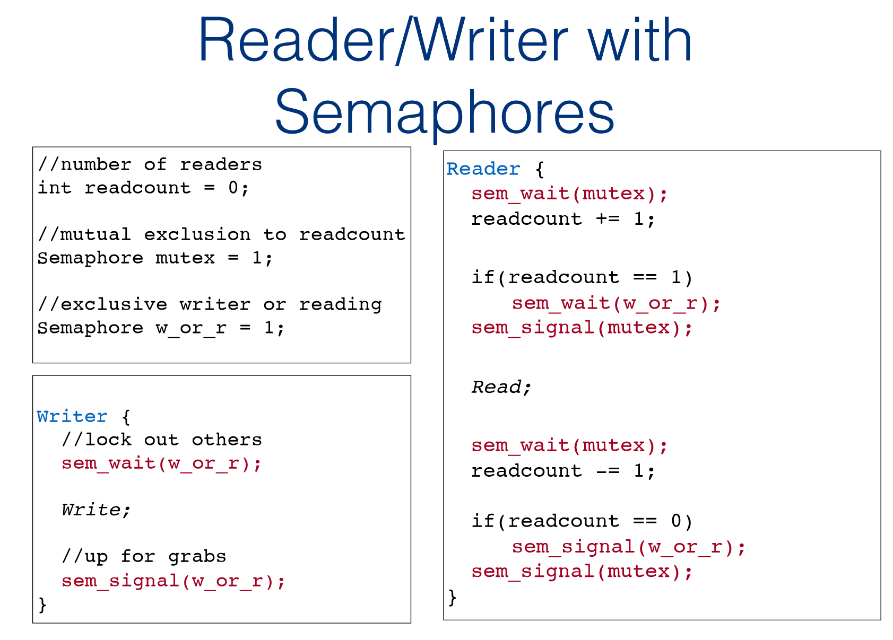
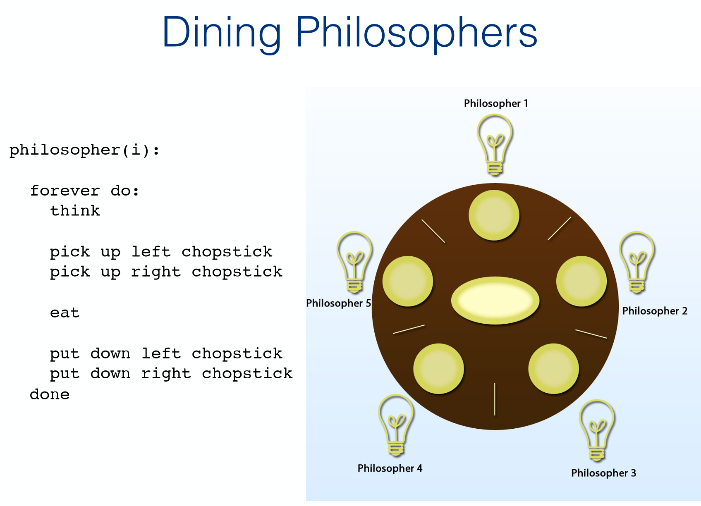
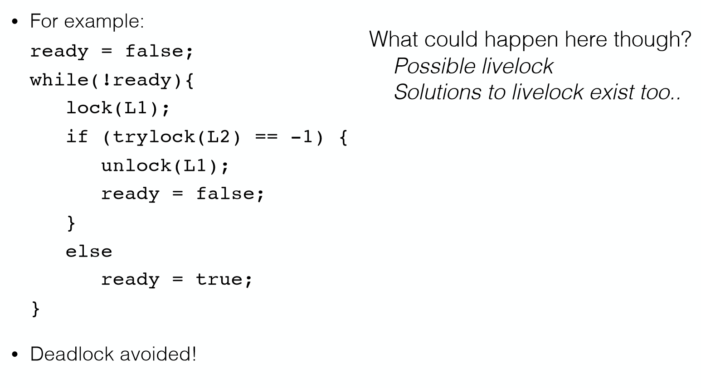

# Synchronization

When two concurrent threads manipulated a shared resource without any synchronization.

Outcome depends on the order in which accesses take place.

- This is called a **race condition**

**Goal: Ensure that only one thread at a time can manipulate the shared resource**

- Synchronization

## Mutual Exclusion

A segment of code which accesses the share resources, called the **curtical section (CS)**

**Goal:** 

- Only one thread at a time can execute in the critical section
- All other threads are forced to wait on entry
- When a thread leaves the CS, another can enter

## Critical Section Requirements 

### Mutual Exclusion

If one thread is in the CS, then no other is

### Progress

If no thread is in the CS, and some threads want to enter CS, only threads trying to get into the CS section(竞争者) can influence the choice of which thread enters next, and choice cannot be postponed indefinitedly. 必须在progressing, some thread must be running instead of all waiting (blocking).

### Bounded Waiting (No Starvation)

If some thread T is waiting on the CS, then there is a limit on the number of times other threads can enter CS before this thread is granted access. 否则如果此thread一直被block，那么将没有进度，starvation.

## Peterson's Algorithm

The threads share the variables turn and flag (where flag is an array, as before)

**Basic Idea:**

- Set own flag (indicate interest) and set turn to self 
- Spin waiting while turn is self AND other has flag set (is interested)
- If both threads try to enter their CS at the same time, turn will be set to both 0 and 1 at roughly the same time.  Only one of these assignments will last.  The final value of turn decides which of the two threads is allowed to enter its CS first.

```c
int turn;
int flags[2];		// Shows interest in the CS. Both are initially 0/false

My_Work(id_t id) {	// id can be 0 or 1
    ...;
    flags[id] = true;	// entry section
    turn = id;
    while (turn == id && flag[1 - id]);
    flags[id] = false;	// exit section
    ...;
}
```

**Explanation:**

Assume there are only two threads, there are only 2 flags in this case.

`flags[id] == true`说明当前thread对critical section感兴趣，想运行CS.

Case 1: 只有一个thread想进入CS

`turn == id` is `true`, `flags[1 - id]` is `false` since there is only one thread setting the flag.

While loop exits, critical section gets executed.

`flags[id]=false` at the end.

Case 2: 两个thread都想进入CS

​	两个thread所对应的flag都是true。

​	Case 2.1: 其中一个thread已经开始执行critical section了另一个才进入`My_work`

​		turn的值是第二个thread的id，那么第二个thread的while loop条件满足，将会无限循环

​		直到前一个（第一个）thread执行完critical section并且set第一个thread的flag为`false`

​		第二个thread while loop结束可以开始执行critical section

​	Case 2.2: 两个thread几乎同时进入`My_work`，都没有开始执行CS

​		turn的值取是后一个（第二个）进来的thread的id。由于两个thread的flag都是true

​		第二个thread的while loop的2个condition都是true，将会循环等待

​		第一个thread的while loop的condition中`turn==id` is false，将会跳过while loop执行CS

​		第一个thread执行完CS后flag值set为false，第二个thread的while loop的第二个condition不满足，开始CS


简单地说，当2个thread同时进入`My_work`时，先进的thread会优先执行CS，第二个thread等到第一个之后再执行。

Peterson’s Algorithm can be extended to N threads

##  Bakery Algorithm 

- Upon entering each customer (thread) gets a #
- The customer with the lowest number is served next
- No guarantee that 2 threads do not get same #
  - In case of a tie, thread with the lowest id is served first
  - Thread ids are unique and totally ordered




## Primitive Locks



### TAS (Test And Set)

```c
bool TAS(bool *lock) {
    bool old = *lock;
    *lock = true;
    return old;
}

// alternative
bool TAS(bool *lock) {     
    if(*lock == False) {         
        *lock = True;          
        return False;     
    } else         
        return True;
}
```

lock is always True on exit from test-and-set 

### Lock Implementation

```c
bool lock; 
void acquire(boolean *lock) {   
    while(test_and_set(lock)); 
} 

void release(booln *lock) {   
    *lock = false; 
}

```

This is a spin lock

Uses busy waiting - thread continually executes while loop in acquire(), consumes CPU cycles

**Explanation:**

`lock` is a boolean variable

`lock = true` means resource in use

`lock = false` means resource free

`release`: lock set to false, meaning that resource is free for other threads to use.

`acquire`: If lock was false, then lock is set to true and while loop is skipped. Current thread obtained the resource and block any other thread tries to acquire the resouce. If lock was true, then some thread is already using the resource and current thread has to wait for that running thread to `release`.

### Three problems of spinlocks

1. Busy waiting

2. Starvation is possible

   - when a thread leaves its CS, the next one to enter depends on scheduling

   - a waiting thread could be denied entry indefinitely (scheduling不知什么时候才会轮到waiting thread)

3. Deadlock is possible through priority inversion

## Sleep Locks

Instead of spinning, put thread to sleep (into "blocked" state) while waiting to acquire a lock

Requires a queue for waiting threads

Linux: wait queues 

```c
wait_event(queue, condition) 
wake_up(wait_queue_head_t *queue);
```

`queue`: the wait queue, storing threads that are waiting

`condition`: used for waiting for a condition to become true, conditions can be any boolean expression

### example for lock

```c
#include <stdio.h>
#include <unistd.h>
#include <pthread.h>
#include <semaphore.h>

/* This example illustrates the use of pthreads and basic locking */

/* A static initializer for the mutex.  
 * Note that mutex and count are global variables so that multiple threads 
 * may share them.
 */
pthread_mutex_t mutex = PTHREAD_MUTEX_INITIALIZER;
int count = 0;

/* The "main" function for a thread.  More than one thread may use the 
 * same function. The function signature is fixed because the function pointer
 * is passed into pthread_create.
 *
 * This function is a simple example of a shared counter.
 */

void *thread1(void *threadid) {
	printf("Start thread %ld\n", (long int)threadid);
	int i;
	for(i = 0; i < 100000; i++) {
		pthread_mutex_lock(&mutex);
	    count ++;
	    printf("%ld, %d\n", (long int)threadid, count);
		pthread_mutex_unlock(&mutex);

		// The sleep call simulates doing other work.
		usleep(2);
	}
	printf("End thread %ld\n", (long int) threadid);

    pthread_exit(NULL);
}


int main(int argc, char *argv[]) {
    pthread_t t1, t2;
    int err;

    err = pthread_create(&t1, NULL, thread1, (void *)0);
    if (err) {
    	printf("Error: pthread_create failed %d.\n", 0);
            return 1;
    }
    err = pthread_create(&t2, NULL, thread1, (void *)1);
    if (err) {
    	printf("Error: pthread_create failed %d.\n", 1);
            return 1;
    }
	
	//pthread_join(t1, NULL);
	//pthread_join(t2, NULL);

    printf("CONTROLLER\n");
    pthread_exit(NULL);
}
```

### Condition Variables

> Always used together with locks 

Abstract data type that encapsulates pattern of "release mutex, sleep, re-acquire mutex"

Internal data is just a queue of waiting threads

Operations are (each of these is atomic): 

- cv_wait(struct cv *cv, struct lock *lock)
  - Releases lock, waits, re-acquires lock before return
- cv_signal(struct cv *cv, struct lock *lock)
  - Wake one enqueued thread
- cv_broadcast(struct cv *cv, struct lock *lock)
  - Wakes all enqueued threads 



The `cond` in `cv_wait` is the condition variable.

`PTHREAD_COND_INITIALIZER` initialize the condition variable.

```c
// pc_cv.c broken
#include <stdio.h>
#include <stdlib.h>
#include <pthread.h>
#include <semaphore.h>

pthread_mutex_t region_mutex = PTHREAD_MUTEX_INITIALIZER;
pthread_cond_t space_available = PTHREAD_COND_INITIALIZER;
pthread_cond_t has_some_data = PTHREAD_COND_INITIALIZER;

#define MAX 25

int buffer[MAX];
int nextfill = 0; 
int nextuse  = 0;
int size     = 0;
int loops    = 0;


void add_buffer(int value) {
	buffer[nextfill] = value;
	nextfill = (nextfill + 1) % MAX;
	size++;
}

int use_buffer() {
	int tmp = buffer[nextuse]; 
	nextuse = (nextuse + 1) % MAX;
	size--;
	return tmp;
}

void* producer(void *arg) {
	int i, id = *(int*)(arg);
	for (i = 0; i < loops; i++) {
		pthread_mutex_lock(&region_mutex);
		if (size == MAX) {
            // release region_mutex lock, wait until space_available, when signaled => re-acquire lock
            // space_available is the condition variable
			pthread_cond_wait(&space_available, &region_mutex);
		}
		printf("Producer[%d] producing: %d\n", id, i);
		add_buffer(i);
		pthread_cond_signal(&has_some_data);	// signal: consumer can use_buffer() now
		pthread_mutex_unlock(&region_mutex);	// unlock mutex
	}
	return NULL;
}

void* consumer(void *arg) {
	int i, id = *(int*)arg;
	for (i = 0; i < loops; i++) {
		pthread_mutex_lock(&region_mutex);
		if(size == 0) {
            // has_some_data is the condition variable
			pthread_cond_wait(&has_some_data, &region_mutex);
		}
		int tmp = use_buffer();
		printf("\tConsumer[%d] consumed: %d\n", id, tmp);
		pthread_cond_signal(&space_available);	// signal: producer can add_buffer()
		pthread_mutex_unlock(&region_mutex);	// unlock mutex
	}
	return NULL;
}

#define PRODUCERS 1
#define CONSUMERS 1

int main(int argc, char* argv[]) {

	int i, pid[PRODUCERS], cid[CONSUMERS];
	if (argc != 2) {
		fprintf(stderr, "usage: %s <value>\n", argv[0]);
		exit(1);
	}
	loops = atoi(argv[1]);
	
	pthread_t P[PRODUCERS], C[CONSUMERS];
	for(i = 0; i < PRODUCERS; i++) { 
		pid[i] = i;
		pthread_create(&P[i], NULL, producer, &pid[i]);
	}
	for(i = 0; i < CONSUMERS; i++) {
		cid[i] = i;
		pthread_create(&C[i], NULL, consumer, &cid[i]);
	}
	for(i = 0; i < PRODUCERS; i++) { 
		pthread_join(P[i], NULL);
	}
	for(i = 0; i < CONSUMERS; i++) { 
		pthread_join(C[i], NULL);
	}
	return 0;
}


```


## Semaphore (信号标)

Semaphore value represents the number of threads that can pass through wait before it blocks.

```{c}
Wait(Sem) {
    while (Sem <= 0);
    Sem--;
}

Signal(Sem) {
    Sem++;
}
```

### Types of Semaphores

#### Mutex (or binary) Semaphore (count = 0/1)

- Single access to a resource
- Mutual exclusion to a critical section

如果有多个thread想改同一个resource，只有一个可以进如critical section，critical section处于`wait`和`signal`之间。



Initial Semaphore S = 1, 也就是说，只有一个thread can pass through wait before it blocks.

当第一个thread call `wait` 之后，$S=0$, 第一个thread会继续往下跑，进入critical section。而在第一个thread call 完`wait`之后但是`signal`还没有被call的时候，如果任何其他的thread call `Withdraw`, 和`wait`, 由于$S=0$, 这些thread都会被while loop block。这个过程中S一直是0，因为只有while loop结束了，S才会-1。

当第一个thread运行完并且call了`signal`之后，S恢复成1。此时，如果有任何其他的thread想运行`Withdraw`, 那么他们都会在`wait`中被block住，`Signal`后轮到某一个thread，因为$S=1$, while loop结束，`S--`变成0，这个thread将会继续向下运行并重复之前描述的第一个thread进行的工作，此时$S=0$, 任何其他thread都会被继续block，等待下一次signal。

#### A binary semaphore (with initial value 1) can be used just like a lock

Then what's the difference? Why bother with both abstractions? 

- Semantic difference – logically, a lock has an “owner” and can only be released by its owner 
- Permits some error checking 
- Helps reason about the correct behaviour 

#### Counting semaphore 

- A resource with many units available, or a resource that allows certain kinds of unsynchronized concurrent access (e.g., reading)
- Multiple threads can pass the semaphore
- Max number of threads is determined by semaphore’s initial value, count
  - Mutex has count = 1, counting has count = N

### Rendezvous Problem



a1 happens before b2: `wait(semB)` waits until a1 is executed and then `signal(semB)` 

b1 happens before a2: `wait(semA)` waits until b1 is executed and then `signal(semA)`

### Producer/Consumer



$full = N$ means that the buffer has a size of N. If every producer add 1 char to buffer, as buffer is full, `sem_wait(full)` will block producer from adding to buffer ($full=0$), until consumer consumes some buffer ($full>0$).

$empty=0$ means that the buffer is initially empty, and consumer has to wait (`sem_wait(empty)`) if the buffer is empty. As Producer execute `sem_signal(empty)`, `empty` gets incremented, and Consumer can escape from blocking. As consumer escapes `sem_wait(empty)`, empty gets decremented again, indicating that 1 unit in buffer is consumed and if $empty=0$, no other consumers can consume (will be blocked). 

`mutex` is used to prevent some producer and consumer from accessing the buffer at the same time. Although the mutex region is different for producer and consumer, they share the same resource, buffer. 

$mutex=1$ means that only one thread can access the region guarded by `mutex`. As `sem_wait(mutex)` is called, if `mutex=1`, then no thread is reading or writing, and can continue to read or write. Before the thread signals, mutex will be always 0, blocking any other read or write (producer or consumer).


### Reader/Writer with Semaphores



`w_or_r` is used to prevent Writer and Reader from reading and writing at the same time. They guards `Write` and `Read` respectively in the code. 

`mutex` is only for Reader, preventing multiple Readers from modifying `readcount` at the same time.

`readcount` is not a semaphore. Its function is to keep track of the number of reader thread at the same time. As `readcount` turns to 1 from 0, that means it's some reader thread's turn to read, and `sem_wait(w_or_r)` to block any writer thread. But if `readcount > 0`, that means some reader thread is already reading, and `w_or_r` is already set to 0, any writer thread is blocked, but new reader thread can still proceed, as reading the same resource can be shared between many reader threads.


## Deadlock (僵局)

### Defining deadlock


### Resource Deadlocks

- We will focus on recource deadlocks
- Root cuases:
  - Recources are finite (比如路只有一条)
  - Processes wait if a recource they need is unavailable
  - Resources may be held by other waiting processes

#### What is a resource?

- Any object that might be needed by a process to do its work
- Hardware: printers, memory, processors, disk drive
- Data: Shared variables, record in a database, files
- Synchronization objects (or equivalently, the critical regions they protect)
  - Locks, semaphores, monitors
- We are concerned with reusable resources
  - Can be used by one process at a time, released

### Conditions for deadlock to occur

1. **Mutual Exclusion**

   Only one process may use a resource at a time

2. **Hold and Wait**

   A process may hold allocated resources while awaiting assignment of others

3. **No preemption (抢先占有)**

   No resource can be forcibly removed from a process holding it

4. Circular Wait

   A closed chain of processes exists, such that each process holds at least one resource needed by the next process in the chain

Together, these four conditions are necessary and sufficient for deadlock.

Circular wait implies hold and wait, but the former results from a sequence of events, while the latter is a policy decision.



### How to deal with deadlocks

> Break one of the four conditions and deadlock cannot occur


### 1. Break Mutual Exclusion?

// TODO

### 2. Break Hold and Wait?

**Problems:**

- May wait a long time for all resources to be available at the same time
- Must acqiore all locks at the start, rather than when they are really needed => limits concurrency
- Some longer processes may hold locks for long time before they end up using them (blocking other processes)
- May not know all resource requirements in advance

**Alternative:**

`trylock()` function is offered in some thread libraries: grab a lock if it's available, otherwise try later.



`ready` means resource is ready. `L2` is the lock for the resource needed, has to lock `L2` first before current thread can access it. 

// TODO

### 3. Break No Pre-emption?

When is it safe to take a resource away from another thread? 

Can one thread pre-empt a thread in a critical section so that it can enter the critical section?

**Generally: Not feasible, or too complex to achieve**

### 4. Preventing Circular Wait

Break "circular wait" - assign a linear ordering to resource types and require that a process holding a resource of one type, R, can only request resources that follow R in the ordering 

Hard to come up with total order when there are  lots of resource types 

Partial order, groups of locks with internal ordering, etc.

### Other Strategies

#### Deadlock Avoidance

Use knowledge about the resources that each process might request to avoid moving into a state that might deadlock.

#### Deadlock Detection 

Use graph algorithms to identify deadlock.

#### Deadlock Recovery

- Tricky
- Selectively kill processes?

### Reality Check

No single strategy for dealing with deadlock is appropriate for all resources in all situations 

All strategies are costly in terms of computation overhead, or restricting use of resources 

Most operating systems employ the "Ostrich Algorithm"

> "Ignore the problem and hope it doesn't happen often"


### Why does the Ostrich Algorithm Work?

**Recall the causes of deadlock:**

- Resources are finite
- Processes wait if a resource they need is unavailable
- Resources may be held by other waiting processes 

Prevention/Avoidance/Detection deal with the last 2 points 

Modern operating systems virtualize most physical resources, eliminating the first problem.

Some logical resources can’t be virtualized (there must be exactly one), such as bank accounts or the process table 

These are protected by synchronization objects, which are now the only resources that can cause deadlock

### Communication Deadlocks

Messages between communicating processes are a consumable resource

Example:

- Process B is waiting for a request 
- Process A sends a request to B, and waits for reply 
- The request message is lost in the network 
- B keeps waiting for a request, A keeps waiting for a reply  =>  we have a deadlock!

**Solution**

Use timeouts, resend message and use protocols to detect duplicate messages (why need the latter?)

TCP (Transmission Control Protocol) guarantees delivery.

Duplicate messages can lead to duplicate response and if the state of process depends on the number requests, duplicate messages could mess up the state.


