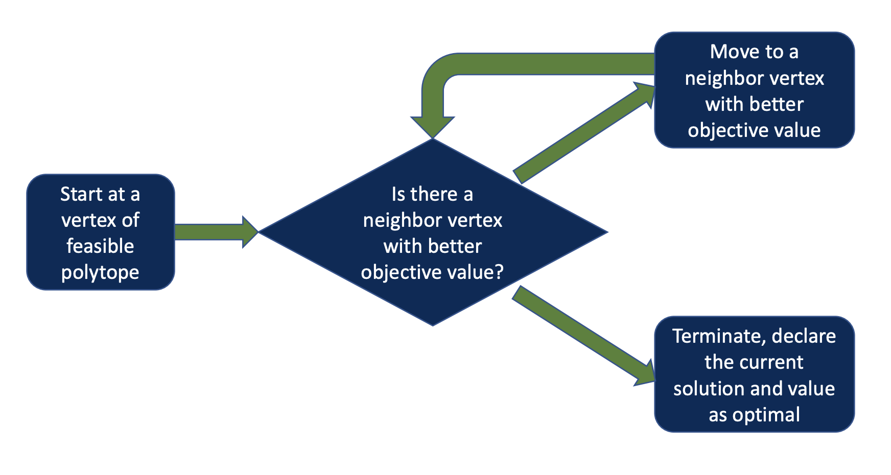
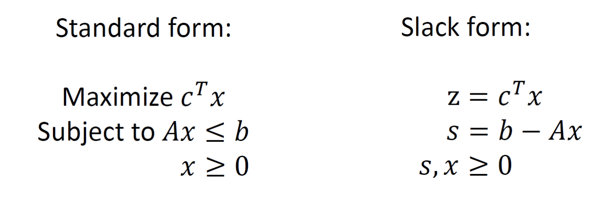

# Linear Programming

## Simplex Algorithm

```
let v be any vertex of the feasible region
while there is a neighbor v' of v with better objective value
	set v = v'
```

**WC** runtime is exponential

Excellent performance in practice



We’ll work with the slack form of LP



`z` stands for the objective function to be maximized

`s` is the difference between `Ax` and `b`, since $Ax\leq b$, $s$ always $>$ 0

