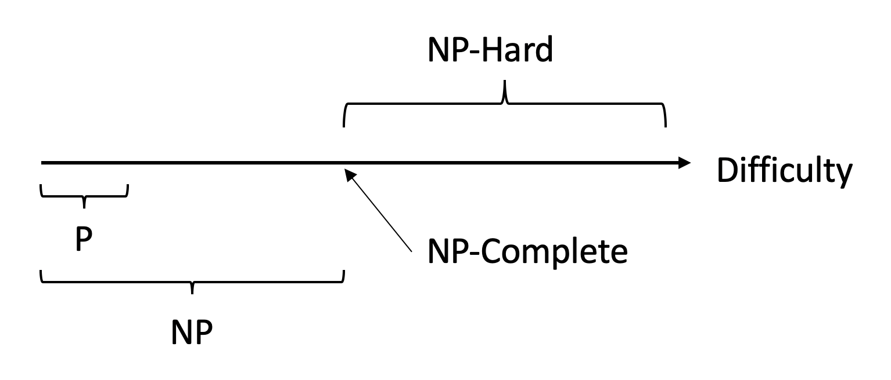

# NP

[Source](https://blog.csdn.net/qq_39521554/article/details/79109278)

**Deterministic algorithm:** we know how each statement works

**Non-deterministic algorithm:** we don't know how it works, we don't know how to write some (part of the) statements

## Non-deterministic Algorithm

- `choice()`
- `success()`
- `failture()`

The above statements are non-deterministic and are assumed to have a runtime of 1.

**P:** A set of deterministic algorithm that takes polynomial time

**NP:** Non-deterministic algorithm that takes polynomial time. For non-deterministic part, we don't know how exactly to achieve.

P is a subset of NP.

Once a NP problem is solved (with deterministic algorithm) in polynomial time, it becomes P.

Any NP today may be P in the future.

## Two Steps

1. Write non-deterministic polynomial time algorithm
2. Relating problems with base problem

## Satisfiability Problem

**CNF-Satisfiability** $RT=O(2^n)$

State space tree, for n elements, each has 2 choices. check $2^n$ in total.

If any problem is similiar to this (same structure), then if one is solved, the other is also solved.

e.g. 0-1 knapsack

## P Problem

> 如果一个问题可以找到一个能在多项式的时间里解决它的算法，那么这个问题就属于P问题

## NP Problem

> NP问题不是非P类问题。NP问题是指可以在多项式的时间里验证一个解的问题。NP问题的另一个定义是，可以在多项式的时间里猜出一个解的问题。

例如：问是否有一个长度小于100（n=100）的路径，搜索时间可能不是Polynomial，但是验证只需要走一遍路径确定起点终点就好了，时间是O(n)，也是polynomial。

下面我要举的例子是一个经典的例子，它指出了一个目前还没有办法在多项式的时间里验证一个解的问题。很显然，前面所说的Hamilton回路是NP问题，因为验证一条路是否恰好经过了每一个顶点非常容易。但我要把问题换成这样：试问一个图中是否不存在Hamilton回路。这样问题就没法在多项式的时间里进行验证了，因为除非你试过所有的路，否则你不敢断定它“没有Hamilton回路”。

> 之所以要定义NP问题，是因为通常只有NP问题才可能找到多项式的算法。我们不会指望一个连多项式地验证一个解都不行的问题存在一个解决它的多项式级的算法

所有的P类问题都是NP问题。也就是说，能多项式地解决一个问题，必然能多项式地验证一个问题的解——既然正解都出来了，验证任意给定的解也只需要比较一下就可以了。

> 现在，所有对NP问题的研究都集中在一个问题上，即究竟是否有P=NP？通常所谓的“NP问题”，其实就一句话：证明或推翻P=NP。

人们普遍认为，P=NP不成立，也就是说，多数人相信，存在至少一个不可能有多项式级复杂度的算法的NP问题。人们如此坚信P≠NP是有原因的，就是在研究NP问题的过程中找出了一类非常特殊的NP问题叫做NP-完全问题，也即所谓的 NPC问题。正是NPC问题的存在，使人们相信P≠NP。

> 简单地说，一个问题A可以约化为问题B的含义即是，可以用问题B的解法解决问题A，或者说，问题A可以“变成”问题B。

《算法导论》上举了这么一个例子。比如说，现在有两个问题：求解一个一元一次方程和求解一个一元二次方程。那么我们说，前者可以约化为后者，意即知道如何解一个一元二次方程那么一定能解出一元一次方程。我们可以写出两个程序分别对应两个问题，那么我们能找到一个“规则”，按照这个规则把解一元一次方程程序的输入数据变一下，用在解一元二次方程的程序上，两个程序总能得到一样的结果。这个规则即是：两个方程的对应项系数不变，一元二次方程的二次项系数为0。按照这个规则把前一个问题转换成后一个问题，两个问题就等价了。

  “问题A可约化为问题B”有一个重要的直观意义：B的时间复杂度高于或者等于A的时间复杂度。也就是说，问题A不比问题B难。这很容易理解。既然问题A能用问题B来解决，倘若B的时间复杂度比A的时间复杂度还低了，那A的算法就可以改进为B的算法，两者的时间复杂度还是相同。正如解一元二次方程比解一元一次方程难，因为解决前者的方法可以用来解决后者。

约化具有一项重要的性质：约化具有传递性。如果问题A可约化为问题B，问题B可约化为问题C，则问题A一定可约化为问题C。

如果能找到这样一个变化法则，对任意一个程序A的输入，都能按这个法则变换成程序B的输入，使两程序的输出相同，那么我们说，问题A可约化为问题B。

我们所说的“可约化”是指的可“多项式地”约化(Polynomial-time Reducible)，即变换输入的方法是能在多项式的时间里完成的。约化的过程只有用多项式的时间完成才有意义。

### NPC

从约化的定义中我们看到，一个问题约化为另一个问题，时间复杂度增加了，问题的应用范围也增大了。通过对某些问题的不断约化，我们能够不断寻找复杂度更高，但应用范围更广的算法来代替复杂度虽然低，但只能用于很小的一类问题的算法。再回想前面讲的P和NP问题，联想起约化的传递性，自然地，我们会想问，如果不断地约化上去，不断找到能“通吃”若干小NP问题的一个稍复杂的大NP问题，那么最后是否有可能找到一个时间复杂度最高，并且能“通吃”所有的 NP问题的这样一个超级NP问题？答案居然是肯定的。也就是说，存在这样一个NP问题，所有的NP问题都可以约化成它。换句话说，只要解决了这个问题，那么所有的NP问题都解决了。这种问题的存在难以置信，并且更加不可思议的是，这种问题不只一个，它有很多个，它是一类问题。这一类问题就是传说中的NPC 问题，也就是NP-完全问题。NPC问题的出现使整个NP问题的研究得到了飞跃式的发展。我们有理由相信，NPC问题是最复杂的问题。再次回到全文开头，我们可以看到，人们想表达一个问题不存在多项式的高效算法时应该说它“属于NPC问题”。此时，我的目的终于达到了，我已经把NP问题和NPC问题区别开了。

> NPC问题的定义非常简单。同时满足下面两个条件的问题就是NPC问题。首先，它得是一个NP问题；然后，所有的NP问题都可以约化到它。

> 证明一个问题是 NPC问题也很简单。先证明它至少是一个NP问题，再证明其中一个已知的NPC问题能约化到它（由约化的传递性，则NPC问题定义的第二条也得以满足

### NP Hard

> NP-Hard问题是这样一种问题，它满足NPC问题定义的第二条但不一定要满足第一条（就是说，NP-Hard问题要比 NPC问题的范围广）。NP-Hard问题同样难以找到多项式的算法，但它不列入我们的研究范围，因为它不一定是NP问题。即使NPC问题发现了多项式级的算法，NP-Hard问题有可能仍然无法得到多项式级的算法。事实上，由于NP-Hard放宽了限定条件，它将有可能比所有的NPC问题的时间复杂度更高从而更难以解决。

## NP Hard

How to show relationship?

- Reduction

If one the NP-hard, the related problems are also NP-hard---Transitivity

A NP-hard problem has non-deterministic polynomial time also => It's NP-Complete

Satisfiability problem is in the set of NP-Hard problems, as well as all problems can be reduced to satisfiability problem.

Cook's theorem: if SAT (satisfiability problem) is a subset of P, then P=NP.

i.e. SAT becomes deterministic if P=NP

## MIT notes

P = {problems solvable in polynomial time}

NP = {decision problems (answer is YES or NO) solvable in nondeterministic polynomial time}

Nondeterministic: can guess one out of polynoially many options in constant time.

​	If any guess would lead to a YES answer, then we get such a guess. (Bias towards YES)

### 3SAT (Satisfiability)

Given Boolean form formula of the form $(x_1\vee x_3\vee \overline{x_6})\wedge (\overline{x_2}\vee x_3 \vee \overline{x_7})$

Each clause has 3 literals, there can be many clauses. Each Literal is a binary variable $x_i$ or $\overline{x_i}$

**Problem/Question:** Can you set the variables $\{x_i\}$ to $\{T,F\}$, such that the formula is True.

This is a hard problem, we don't know if there is a polynomial time algorithm (probably there isn't), but there is a polynomial non-deterministic algo (Problem is in NP).

Guess whether $x_i$ is true or false for all $i$, every guess takes constant time.

If formula is true, return YES, NO otherwise.

If there is some way to get the formula true, algo will return YES.

Think of this as a verification algorithm.

Given the guess, check the guess in polynomial time.

Can only do that for YES answers. Not for NO answers. If some one say, there is no such solution the gives a YES answer, you have to check all combinations of the variables.

There is a easy way to verify that it's true. Thus, it's a NP.

### Equivalent Definition of NP:

NP = {Decision problems with poly-size certificates & poly-time verifiers fir YES problems}

Certificate is a guess of solution. And we can only guess something that's polynomial size (non-exponential).

x is NP-hard if every problem $y\in NP$ reduces to $x$. $x$ is at least as hard as every problem in NP.

x in NP-complete if x is NP and NP-hard. $x$ is exactly as hard as every problem in NP, no harder, no easier.

**Reduction** from problem A to problem B = poly-time algo converting A inputs -> equivalent B inputs.

Equivalent means: same YES/NO answer.

**Difficulty:** 

$x$ is NP-hard $\Rightarrow$ $x\notin P$ unless P=NP.

Since NP-hard is at least as hard as all NP, thus, if $P\neq NP$, NP-hard must be harder than P, and time larger than polytime is needed to solve for $x$.

### Reduction

**Reduction** from problem A to problem B = poly-time algo converting A inputs -> equivalent B inputs.

Equivalent means: same YES/NO answer.

If we know how to solve B, than we also know how to solve A.

- Convert the inputs for A to inputs for B, run B's algo, and get the YES/NO decision for A.

$B\in P\Rightarrow A\in P$

$B\in NP\Rightarrow A\in NP$

B is at least as hard as A.

If we want to show that some problem x is NP-Hard, we need to show that every problem in NP can be reduced to x.

## Proving problem is NP-Complete

This means, problem is too hard and cannot be solved in polynomial time.

1. $x\in NP$
   1. Give non-deterministic poly-time algo
   2. Certificate + verifier in poly-time
2. Reduce from known NP-Complete problem $y$ to $x$, to show $x \in$ NP-Hard
   - We cannot show it for all NP, thus show it for one NP-complete is enough, since NP-complete problem is both NP and NP-Hard, if a NP-Complete problem is reducible to $x$, $x$ is at least as hard as it, and thus $x$ is NP-Hard
   - $z\in NP \rightarrow y\rightarrow x$, $\rightarrow$ means reducible. $x$ is also as hard as all NP, thus is NP-Hard.

