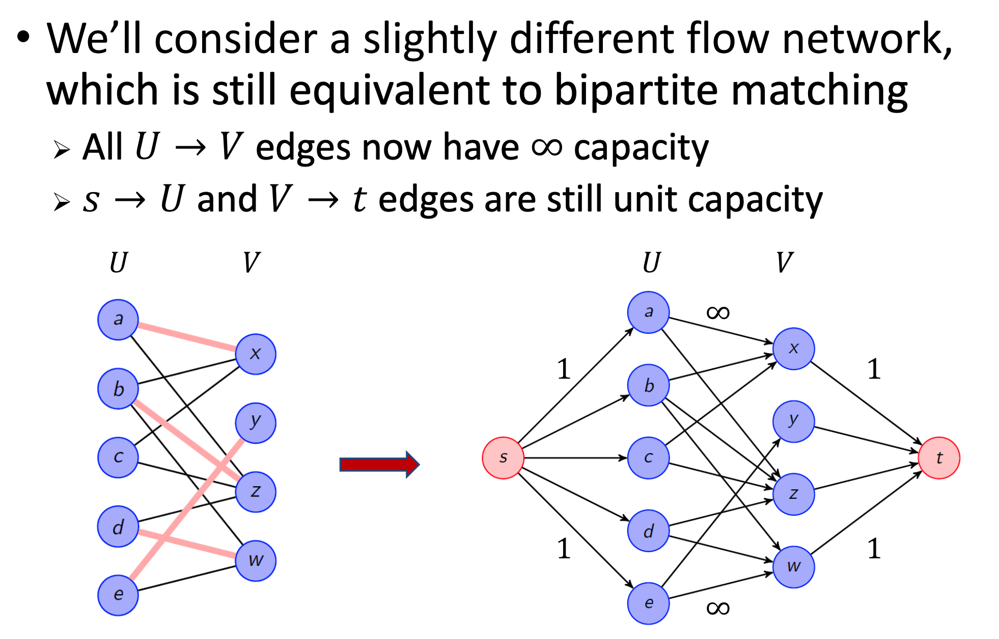

# Network Flow

## Problem

### Input: 

- A directed graph $G=(V, E)$
- Edge capacities $c:E->R_{\geq0}$
- Source node $s$
- Target node $t$

### Output

Maximum flow from $s$ to $t$.

### Assumption (For Simplicity)

- Edge capacity $c(e)$ is a non-negative **integer**
- Not edges enters $s$
- Not edges comes out of $t$

### Flow:

$f(e)$ is the "amount of material" carried on edge $e$

### Constraints on flow

1. $\forall e \in E: 0\leq f(e)\leq c(e)$
2. 对于每个vertex，进入v的flow=离开v的flow，守恒

## First Attempt

A natural greedy approach:

while there exists an $s-t$ path $P$ in $G$ such that $f(e)<c(e)$ for each $e\in P$

(while 存在一条path，上面所有的edge的capacity都没有满，所以此path还可以加flow)

1. Find one such path

2. Increase the flow on each edge $e\in P$ by $min_{e\in P}(c(e)-f(e))$

   Increase by 此path上所有edge中最小的剩余capacity，也就是此path上能增加的最大flow

发现此algorithm并非最优解，为什么？

- Once it increases the flow the flow on an edge, it is not allowed to decrease it.

Need a way to "rever" bad decisions.


**Explanation: **

- 每一个edge有最多2个edge
  1. Forward Edge: $c(e)-f(e)$，剩余flow capacity
  2. Reverse Edge: $f(e)$, 已经发了多少flow才能返回多少flow
- We only add each edge if its capacity > 0


## Augmenting Path

Let 𝑃 be an $s-t$ path in the residual graph $G_f$

Let **$bottleneck(P,f)$** be the smallest capacity across all edges in $P$

"Augment" flow $f$ by sending $bottleneck(P,f)$ units of flow along $P$

- For each forward edge $e\in P$, increase the flow on $e$ by $x$

  如果send along forward edge，increase the flow on $e$ by $x$

- For each reverse edge $e^{rev}\in P$, decrease the flow on $e$ by $x$

  如果send along reverse edge decrease the flow on $e$ by $x$

一条path中，forward edge和reverse edge可以混合，而不需要是同一种，目的就是为了不断增加总flow

## Ford-Fulkerson Algorithm

```
MaxFlow(G)
	// initialize
	Set f(e) = 0 for all edge e in G
	
	// while there is an s-t path in Residual Graph G
	while P = FindPath(s,t,Residual(G,f)) != None:
        f = Augment(f,P)
        UpdateResidual(G,f)
	EndWhile
	return flow f
```

## Running Time

### Number of Augmentations:

- At every step, flow and capacities remain integers
- For path $P$ in $G_f$, $bottleneck(P, f)>0$ implies $bottleneck(P, f) \leq 1$
- Each augmentation increases flow by at least 1
- Thus, at most $C=\sum_{e\text{ }leaving\text{ }s} c(e)$, 因为从0开始，最多augment $C$ 次，就能达到最高值$C$，因为 $C$ 是能从$s$出发的最高值。C是始于$s$的所有edge capacity之和。

### Time for an augmentation

- $G_f$ has $n$ vertices and at most 2m edges。假设$G$有$m$ edges，reverse + forward edge就是原先的2倍
- Finding $s-t$ path in $G_f$ takes $O(m+n)$ time, (BFS)

### Total Time:

$O((m+n)\cdot C)$, 每次$(m+n)$,最多做$C$次

Is this a polynomial time algorithm?

> This is **pseudo-polynomial time**

$C$ can be exponentially large in the input length (the number of bits required to write down the edge capacities). Say, there are 10 edges, one of them has a capacity of $10^{10}$.

### Can we convert this to polynomial time?

- Not if we choose an arbitrary path in $G_f$ at each step.
- In the graph below, we might end up repeatedly sending 1 unit of flow across $a\rightarrow b$ and then reversing it. 
- Takes $X$ steps, which can be exponential in the input length.
- 


### Ways to achieve polynomial time

Find the shortest augmenting path using BFS

- Edmonds-Karp algorithm
- Runs in $O(nm^2)$ time
- Can be found in CLRS

Find the maximum bottleneck capacity augmenting path

- Runs in $O(m^2\cdot \log C)$
- "Weakly polynomial time" (number of arithmetic operations depends on the number of bits used to write integers)


## Cuts and Cut Capacities


## Theorem:

For any flow $f$ and any $s-t$ cut $(A,B)$, $v(f)=f^{out}(A)-f^{in}(A)$.

**Proof:** Just need to apply flow conservation


$v(f)$ 就是flow的值

$cap(A,B)$ 是A到B的flow之和，不算从B到A

所以 The maximum flow is at most the minimum capacity of any cut.

In fact, we will show that the maximum flow is equal to the minimum capacity of any cut. 

To demonstrate the correctness (i.e. optimality) of FordFulkerson algorithm, all we need to show is that the flow it generates is equal to the capacity of some cut.

**Theorem:** In any graph, the value of the maximum flow is equal to the capacity of the minimum cut.


## Edmonds-Karp Algorithm

```
MaxFlow(G)
	// initialize
	Set f(e) = 0 for all edge e in G
	
	// Find shortest s-t path in residual graph and augment
	while P = BFS(s,t,Residual(G,f)) != None:
        f = Augment(f,P)
        UpdateResidual(G,f)
	EndWhile
	return flow f
```


**Property:**

$P$ is a shortest $s\rightarrow t$ path in $G$ if and only if $P$ is an $s\rightarrow v$ path in $L_G$

因为如果path不在$L_G$中，我们总能找到一条在$L_G$中更短的path。

#### Lemma 1

​	Length of the shortest $s\rightarrow t$ path in $G_f$ never decreases ($G_f$ is the residual graph)

**Proof: **

Let $f$ and $f'$ be flows before and after an augmentation step, and $G_f$ and $G_{f'}$ be their residual graphs.


Augmentation happens along a path in $L_{G_f}$(level graph of the residual graph)

因为之前我们说找到的shortest path一定是在level graph中的

Opposite direction edges can’t help reduce the length of the shortest $s\rightarrow t$ path

**QED**

#### Lemma 2

After at most $m$ augmentations, the length of the shortest $s\rightarrow t$ path in $G_f$ must strictly increase. 

**Proof: **

- In each augmentation step, we remove at least one edge from $L_{G_f}$. Because we make the flow on at least one edge on the shortest path equal to its capacity. 因为每次augmentation的flow量都是根据一个shortest path上的bottleneck值决定的，augment完后这个bottleneck一定会被填满，也就是说，这个没有剩余capacity的edge会被removed.

- No new edges are added in $L_{G_f}$ unless the length of the shortest $s\rightarrow t$ path strictly increases.
- This cannot happen more than $m$ times!

### Theorem: The algorithm takes $O(m^2n)$ time.


# Bipartite Matching

## Problem:

Given a bipartite graph $G=(U\cup V, E)$, find a maximum cardinality matching.

Goal: U，V间有很多edge，每一个vertex in U, 每一个vertex in V只能连上最多一条edge，我们想要maximum连接数量。可以转换成max flow problem。

But it can be reduced to max-flow.


所有edge的capacity都是1。


**Perfect Matching=flow with value $n$**, where $n=|U|=|V|$, 所有都一一对应。

## Hall's Marriage Theorem


$N(S)$指的是$S$在$V$中的neighbor。

当$U$的任意subset $S$，其中每个vertex在$V$中都能找到对应的vertex时，能达到perfect matching。

考虑$S$中一个vertex连上$V$中所有vertice，剩下的没有match。这种情况不存在，因为条件中对于$U$的任意subset $S$，我们可以不选这个占用很多$V$的vertex，那么如果还是能找到多于$|S|$个对象，perfect matching可以被达到。




## Edge-Disjoint Paths


## Multiple Sources/Sinks


## Circulation


