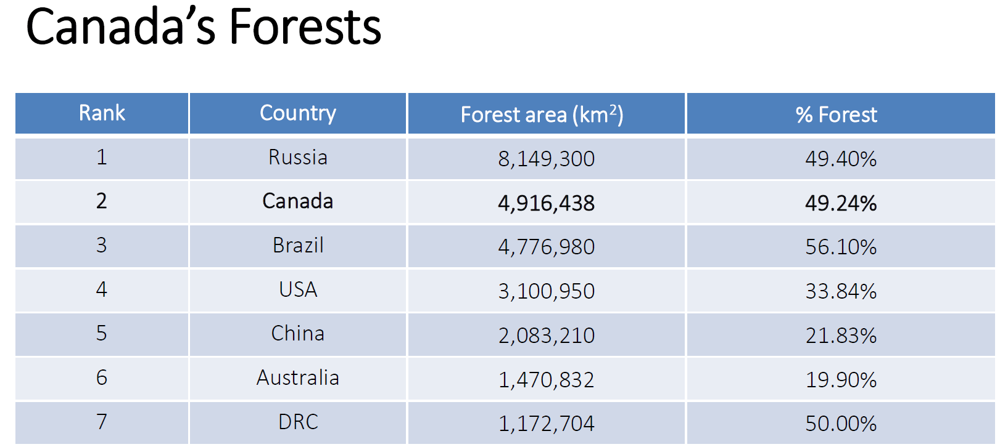
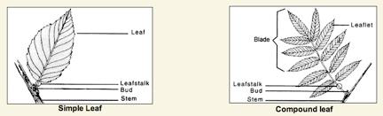
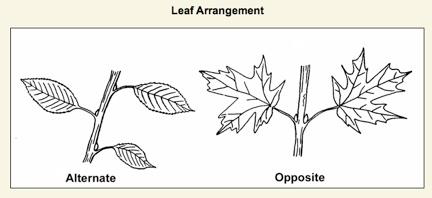
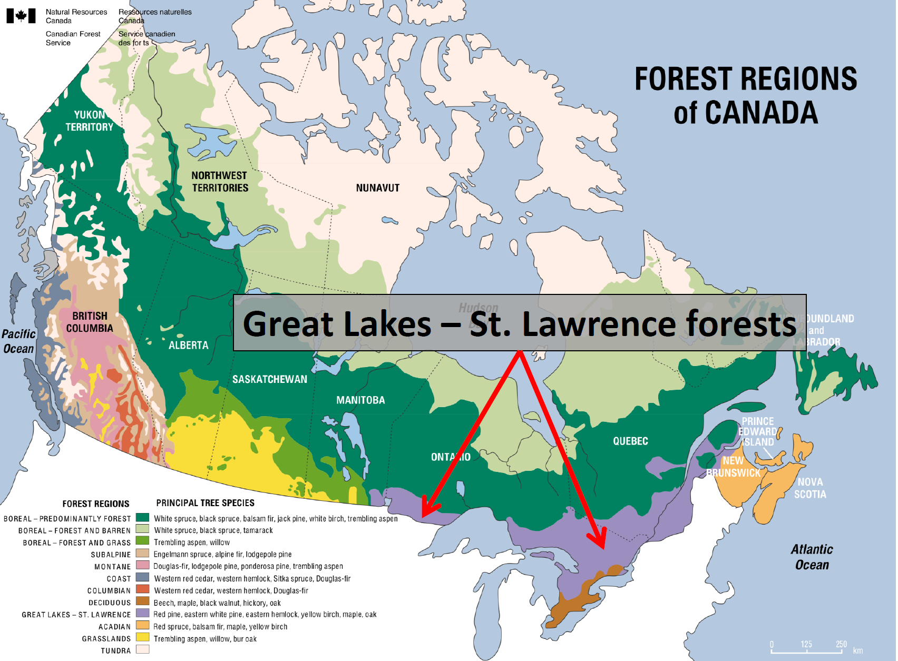

# Week 1

impact = per capita demand x total population

Careful, scientifically informed, evidence based, ethical, and equitable conservation strategies are needed.

- Conservation sustainable use and management of natural resources.

- Preservation protection of natural areas by restricting or banning human access and use.

Conservation ≠ Preservation

The major difference is that preservation aims to exclude humans from natural areas; conservation includes human activity.

Current species extinction rates are 8 100 times higher than historical levels (Ceballos et al 2015)

The main driver of species extinction is habitat loss and degradation

## Forest Definition

- Area > 0.5 hectare
- land with tree crown cover > 10%
- Trees height >= 5m at maturity

Canada contains 9% of the world’s forests

This amounts to 347 million ha of forest, of which 270 million ha are boreal forest

## Forest conservation
Forest conservation is the art, science, and practice of sustainably managing forested lands, as well as the ecological and evolutionary processes that comprise them, for the ecological, economic, cultural, and social values they provide.

# Week2

**Plan**

1. Tree identification
2. Forest regions of Canada
3. The boreal forest
4. Forest Health and resilience

## Tree Identification

Taxonomic classification: 系统分类

### Taxonomic classification

There are two main types of trees: **gymnosperms(裸子植物)** and **angiosperms (被子植物)**

These are equivalent to coniferous (evergreen trees) and deciduous (broad leaved trees).

These are equivalent to coniferous (evergreen trees) and deciduous (broad leaved trees).

- Sperm = seed

- Gymno = naked

- Angio = hidden
  

Naming:

Genus(属)+ species(物种) (Family; Order ; Class; Phylum; Kingdom)

E.g., Homo sapiens; Pinus strobus

Sugar Maple - Acer(Genus) saccharum(species epithet) (Sapindaceae = family(科))

### Leaf Shape
- Simple vs. compound leaves
- Even vs. odd pinnate compound leaves
- Alternate vs. opposite leaf arrangement

Simple vs. compound leaves

Alternate vs. opposite leaf arrangement

Even vs. odd pinnate compound leaves

  

## Forest Regions of Canada

1. Great Lakes St. Lawrence
2. Deciduous (Carolinian)
3. Acadian
4. Coastal
5. Montane
6. Subalpine
7. Columbian
8. Boreal

### GREAT LAKES ST. LAWRENCE FOREST

- 2nd largest forest type in Canada (~ 26 million ha)
- 6.6 % of Canada’s forest land
- Transitional forest: coniferous forest N, and deciduous forest S
  - coniferous forest 针叶林
  - deciduous forest 落叶林
- Between 60 100 tree species
- Sugar maple ( Acer saccharum ) up to 30% of trees in central Ontario forests

### important tree species

- Deciduous species
  - Poplars ( Populus balsamifera, P.tremuloides
  - Birches ( Betula papyrifera , B.allagheniensis
  - Beech ( Fagus grandifolia
  - Maples ( Acer rubrum, A. pennsylvanicum
- Coniferous species
  - Pines ( Pinus resinosa
  - Spruce ( Picea glauca, P. rubens
  - Balsam fir ( Abies balsamea

