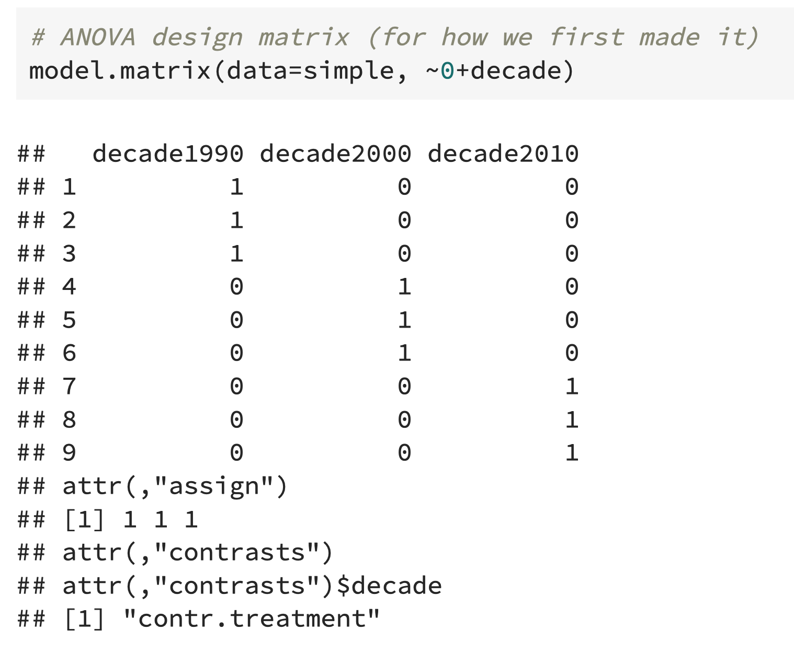

---
output:
  pdf_document: default
  html_document: default
---
# Week 1 ANOVA

## Linear Model

$Y=\beta_0+\beta_1 x_{1i}+\dots+\beta_px_{pi}+\epsilon_i$

$i$ represents number (index) of data.

$Data=Model+Error$

### Linear Regression assumptions

1. Independent errors (observations (y's) are independent)
2. Errors are identically distributed, $E[\epsilon_i]=0$
3. Constant variance (homoscedasticity), $var[\epsilon_i]=\sigma^2$
4. Straight-line relationship exists between the errors $\epsilon_i$ and responses $y_i$, linearity

Usually, $$\epsilon_i\sim N(0,\sigma^2)$$

## ANOVA

### Hypotheses

$$H_0:\mu_1=\dots=\mu_n$$

$$H_1:\text{at least one mean is different from the others}$$

### ANOVA Assumptions

1. Errors are independent (observations are independent), test with Residual plot
2. Errors are normally distributed with $E[\epsilon_i]=0$, test with QQ-plot
3. Constant variance (homoscedasticity), $var[\epsilon_i]=\sigma^2$

Test third assumption: if the ratio of the largest within-in group variance estimate to the smallest within-group variance estimate does not exceed 3, $s^2_{max}/s^2_{min}<3$, then the assumption is probably satisfied.

### A Note on Normality

If $N$ is large, by **Central Limit Theorem** to the rescue, the normality assumption can be relaxed if you have a large sample size. 

**The normality assumption is most important when:**

- $n$ is small
- highly non-normal
- small effect size

**ANOVA** is a specific case of the general linear model. 

$$Y=X\beta$$

### Code

```R
anova1 <- aov(av_rating~decade, data=my_genre_data)
summary(anova1)

lm1 <- lm(av_rating~decade, data = my_genre_data)
summary(lm1)
```


Df of decade: number of $ x=$ number of $\beta-1$

Df of Residuals: degree of freedom

$n=2+1+2263=2266$

Sum Sq$\div$Df$=$Mean Sq (Elementwise division)

$\text{Mean Sq decade}\div\text{Mean Sq Residuals}=\text{F value}$


ANOVA table 中最后一列 F-Test的p-value跟lm summary中最后一行的p-value是一样的。

The p-value in the last column of the ANOVA table for F-Test is the same as the p-value in the last row of lm's summary.

In `lm` summary, `intercept` $\beta_0$ is the mean of the reference group, say it's $\mu_{1990}$. In this case, it's the mean `av_rating` of decade 1990. `decade2000` $\beta1$ $=\mu_{2000}-\mu_{1990}$. `decade2010` $\beta1$ $=\mu_{2010}-\mu_{1990}$.


### Two ways to write the model

$$y_i=d_{1990}\mu_1+d_{2000}\mu_2+d_{2010}\mu_3+\epsilon_i$$

**One-hot Encoding**

|      | $\beta_0$ | $\beta_1$ | $\beta_2$ |
| ---- | --------- | --------- | --------- |
| 1990 | 1         | 0         | 0         |
| 2000 | 0         | 1         | 0         |
| 2010 | 0         | 0         | 1         |



$$y_i=\beta_0+\beta_1d_{2000}+\beta_2d_{2010}+\epsilon_i$$

|      | $\beta_1$ | $\beta_2$ |
| ---- | --------- | --------- |
| 1990 | 0         | 0         |
| 2000 | 1         | 0         |
| 2010 | 0         | 1         |


In the above case, $\beta_0$ represents the mean `av_rating` of 1990 (reference group). And thus the column of intercept is always 1.

