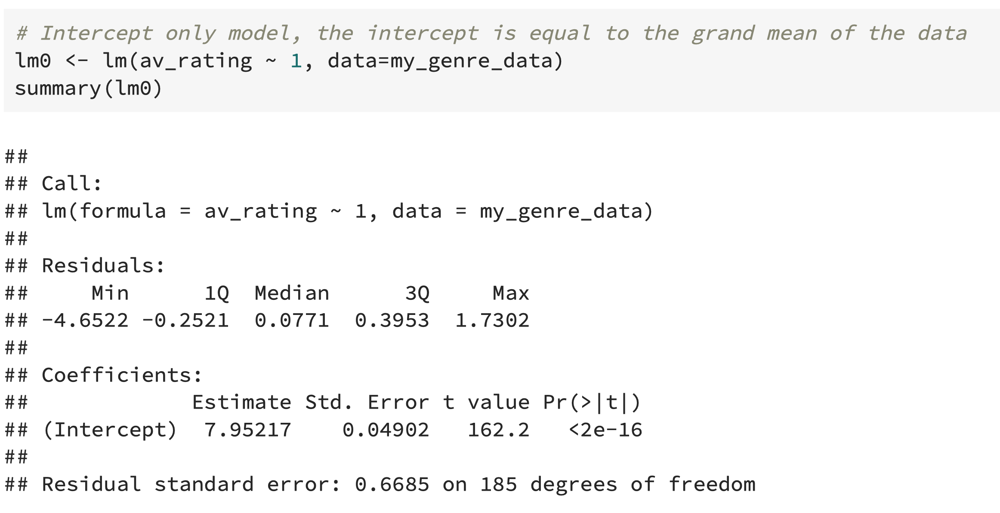

# Week2 ANOVA And GLM Part 1

## ANOVA as a test

**Group Mean:** $\hat{\mu_j}=\text{mean}\{\hat{y}_j,j=1\dots J_i\}$,  $j$ represents index of some group, $i$ represents the index of every sample in the group.

**Grand Mean:** $\hat{\mu}_0=\text{mean}\{\hat{y_{ij}, i=\dots k, j=1\dots J_i}\}$, $i,j$ represent the same thing as above, grand mean is the mean of all samples regardless of group.

$$\frac{\sum_j n_j(\hat{\mu}_j-\hat{\mu}_0)^2/(k-1)}{\sum_{ij}(\hat{y}_{ij}-\hat{\mu}_i)^2/(N-k)}\sim F_{N-1,N-K}$$

$$\frac{\text{variability between groups}}{\text{variability within groups}}\sim F_{N-1, N-k}$$

$N-k$ is the number of observation groups.

### Notes

ANOVA will reject $H_0$ for any large datasets. Large dataset $\rightarrow$ large numerator $\rightarrow$ large F value $\rightarrow$ small p-value $\rightarrow$ reject $H_0$.

ANOVA can be useful when a dataset is small, for large datasets, fit a random effects model.

# Likelihood-ratio Test

> A different way to check if there is a difference between models.

> The **likelihood-ratio test** lets us compare the goodness of fit of two competing models based on the ratio of their likelihoods.

### Hypotheses

- $H_0: Y_{ij}\sim N(\mu_0, \sigma^2)$
- $H_a: Y_{ij}\sim N(\mu_j, \sigma^2)$, prediction does depend on different groups

Likelihood under $H_a$ is always larger than $H_0$. More feature is better. But if $H_0$ is true, $H_a$'s likelihood shouldn't be much larger.

2 $\times$ the difference in log likelihoods will follow a chi-square distribution if $H_0$ is true. (all hypothesis testing is done as if the null is true)

$$2[\log L(\hat{\beta},y)-\log L(\hat{\beta}^{(C)},y)]\sim \chi^2_P$$

$P$ is the number of parameters in $\beta$. 是2个相比较的model中相差几个$\beta$.

# GLM Generalised Linear Model

## Assumptions of the GLM

- $Y's$ are independently distributed, as well as the errors.

- The dependent variable $Y_i$ does not need to be normally distributed, but it assumes a distribution, typically from an exponential family (e.g. binomial, poisson, multinomial, normal, ...)

- GLM does NOT assume a linear relationship between the dependent variable and the independent variables, but it does assume a linear relationship between the transformed response (in terms of the link function) and the explanatory variables. e.g. for binary logistic regression $logit(\pi)=\beta_0+\beta X$

  $\pi$ represents the probability. $$\log{\frac{\pi}{1-\pi}}=X\beta$$

- Explanatory variables can be even the power terms or some other non-linear transformations of the original independent variables. 

- The homogeneity of variance does NOT need to be satisfied. 

- It uses maximum likelihood estimation (MLE) rather than ordinary least squares (OLS) to estimate the parameters, and thus relies on large-sample approximations.

## Components of a Generalised Linear Model

1. **random component**: the response and an associated probability distribution
2. **systematic component**: explanatory variables and relationships among them (e.g., interaction terms) 
3.  **link function**, which tell us about the relationship between the systematic component (or linear predictor) and the mean of the response

It is the **link function** that allows us to generalise the linear models for count, binomial and percent data. It ensures the linearity and constrains the predictions to be within a range of possible values.

# Binomial (or logistic) Regression

## Notes

- No closed form MLEs for GLMs 
- Derivatives are easy so maximization is quick

## Interpreting Logistic Model

