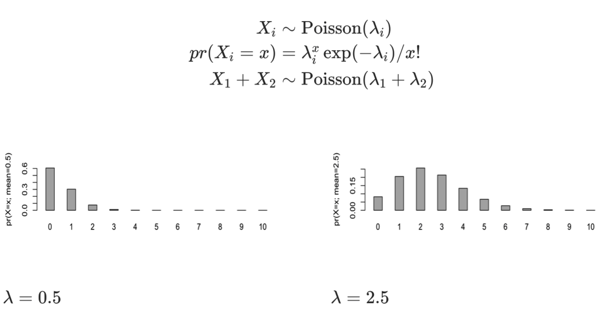
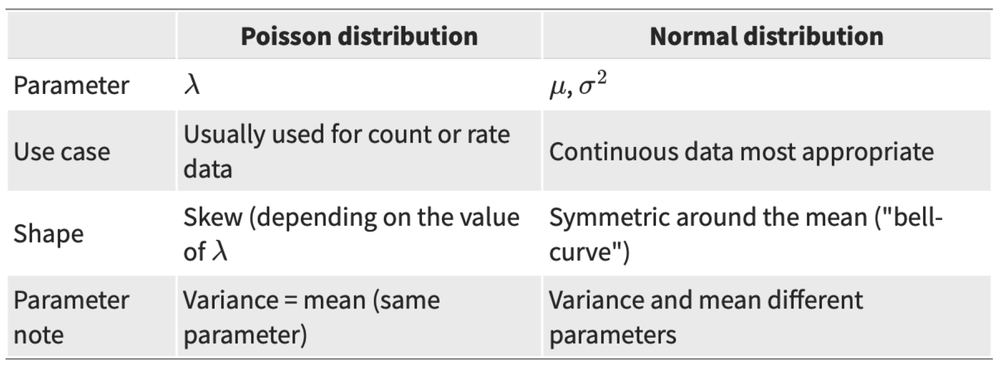
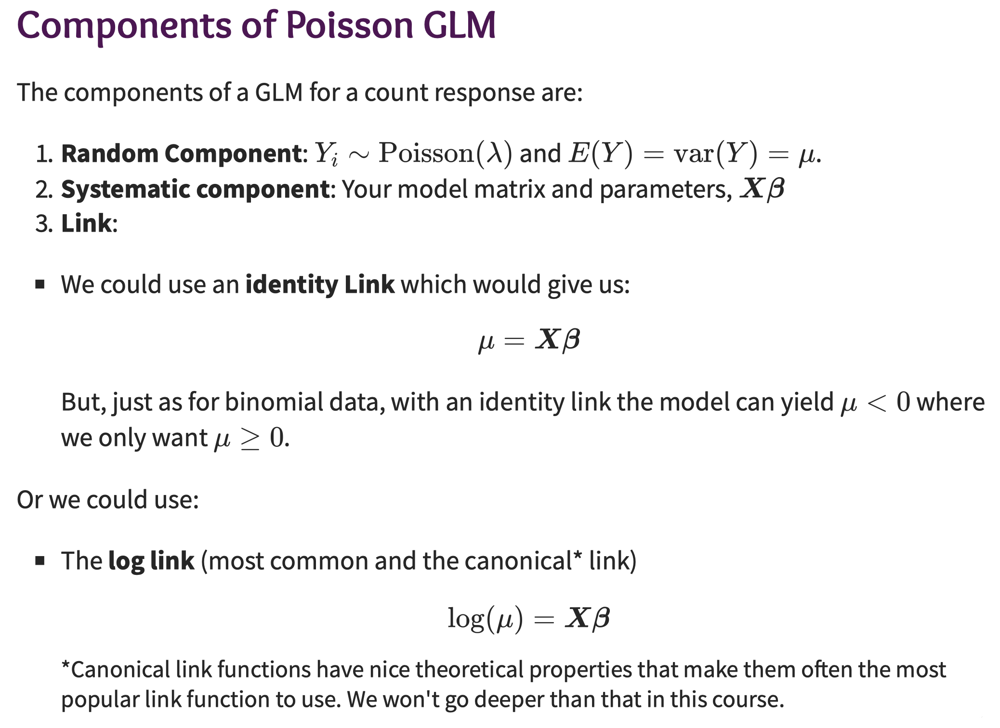
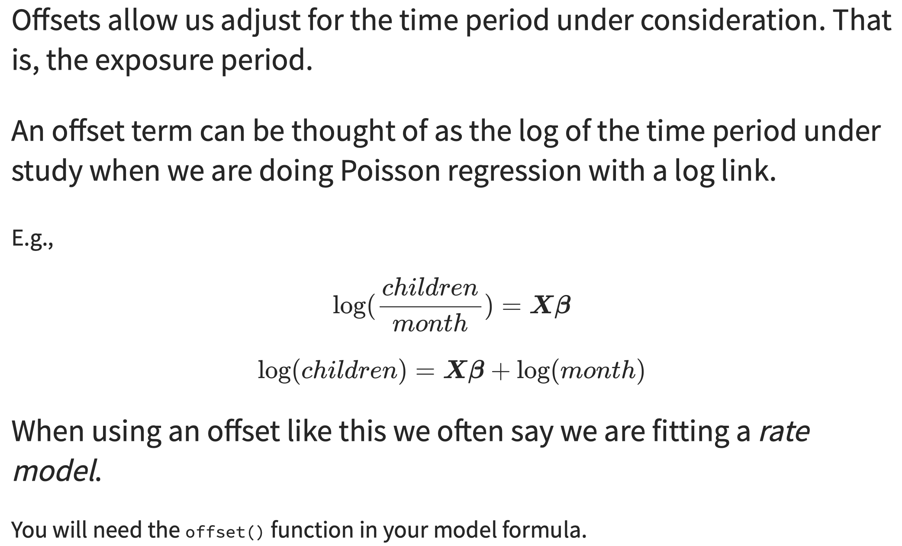
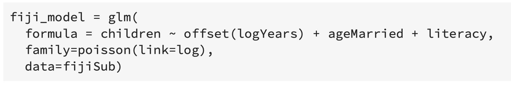
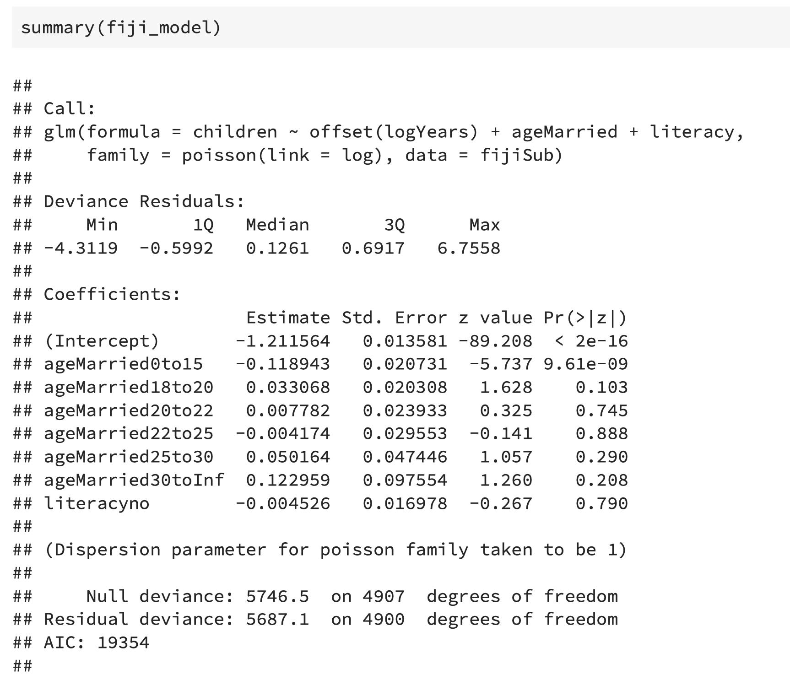
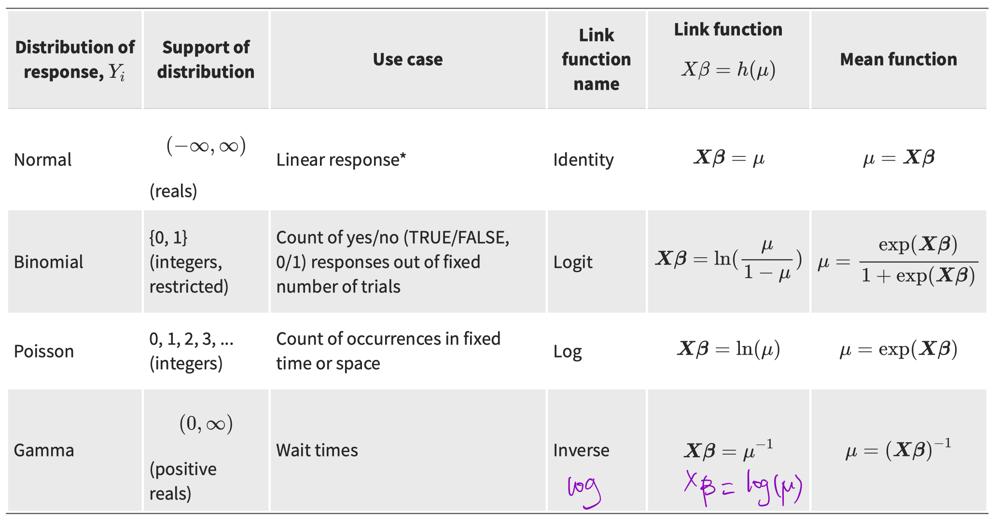

# Week3 GLM Part 2

## Continue Binomial (Logistic) Regression

$logit(\pi)=\log \frac{\pi}{1-\pi}	$		(log odds)

$\pi=\exp(logit(\pi))=\exp(\log \frac{\pi}{1-\pi})=\frac{\pi}{1-\pi}$ 	(odds)

Log odds 之间是差的关系，加减，一个比另一个多多少。

odds 之间是比例关系，一个是另一个的多少倍，百分之多少。

For example, $\beta_7$ represents `ruralUrban`, $x_7=1$ if rural, $0$ if urban.

Rural: log odds$=\beta_0+\beta_1x_1+\dots+\beta_7\cdot1$

Rural: log odds$=\beta_0+\beta_1x_1+\dots+\beta_7\cdot0$

$[\text{log odds}]_{rural}-[\text{log odds}]_{urban}=\beta_7=0.43$， 差的关系

$\text{odds}_{rural}=\exp(\beta_0+\cdots+\beta_7)$		Since $x_7=1$

$\text{odds}_{rural}=\exp(\beta_0+\cdots+0)$		Since $x_7=0$

$\text{odds ratio}=\frac{\text{odds}_{rural}}{\text{odds}_{urban}}=\exp(\beta_7)$, 比例关系

odds ratio: 保持其他条件($x_i$) 不变，只改变一个$x$, 对应的$\beta$所能带来的两种情况的ratio。

# Poisson Regression

Poisson Distribution's mean and variance should be the same.

## Offsets

### Code

"Dispersion parameter for poisson family taken to be 1" means, the mean and variance for the poisson model are approximately equal $\rightarrow$ good model.

# Gamma GLM

**Random Component:** $Y_i\sim Gamma(\phi,\nu), E(Y)=\phi\nu,var(Y)=\phi^2\nu$

**Systematic Component:**Model matrix and parameters. $X\beta$

**Link:**

​	**log link:** $\log(\mu)=X\beta$

​	**inverse link:** $\frac{1}{\mu}=\mu^{-1}=X\beta$

# Diagnostics of GLMs

1. Assessing model fit is diicult for binary and count data! 
2. Residuals don't have nice properties 
3. Histograms can be useful, as can exploratory plots 
4. A goodness of fit test is a test of how much data you have

# Notes on GLMs with continuous data

- It's not easy to test which distribution is best, since they are not nested. 
- GLMs are **not** often used with continuous data
  - they're almost always Binomial or Poisson
  - with the notable exception of the Weibull for event times 
- 'standard practice' is to transform continuous data to normality (logs, Box-Cox)

# Summary

## Constraints on the vector of regression coefficients $\beta$ in restricted model

In a likelihood ratio test, two models are required to perform the test. One should be nested within the other. 

What are the constraints on the vector of regression coefficients, $\beta$?

- The constraints are on the variables in the complicated model but not in the simple model.
- For example, for a binary $x$, such as literacy, the constraint will be setting the $\beta=0$ for literacy in the complicated model. The purpose is to ignore this $x$.

## Check Assumptions

### Linear Model

- Residual Plot: Constant Variance
- QQ-Plot: Normality
- Independence: explain with words

### GLM

Check histogram to see if data follow a specific distribution.

### 判断一个variable是否有必要的方法

Every variable corresponds to a $\beta$, the $\beta$ has an estimate after fitting a model, and the confidence interval can be obtained. If the confidence interval contain 0, then the variable may not be needed (没有作用). 

$e^\beta$ is the odds ratio, $e^0=1$. Thus, if the odds ratio's confidence interval contain 1, the variable may not be needed. 

These two methods are equivalent.

