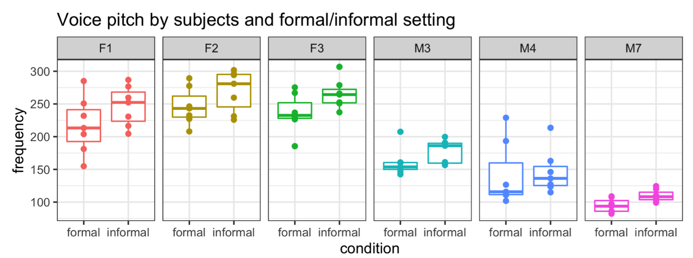
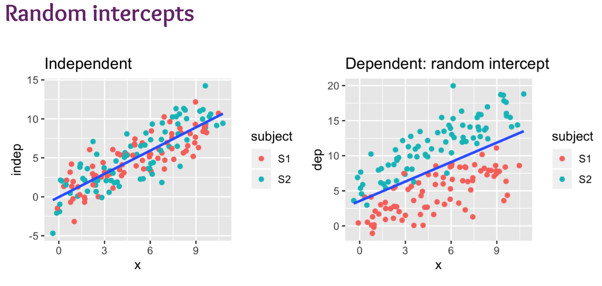
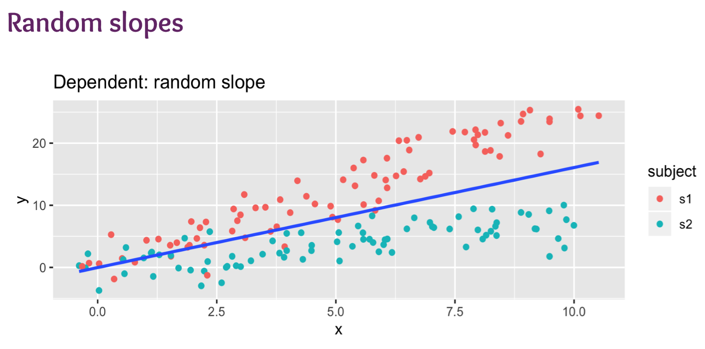
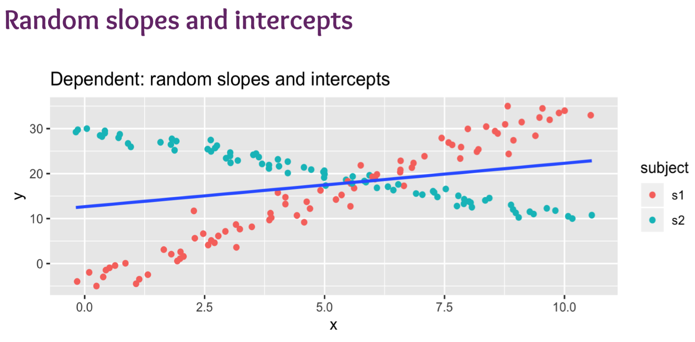

# Week 4 Linear Mixed Models

## Recall Linear Regression Assumptions

1. Errors are independent (observations are independent)
2. Errors are identically distributed, $E[\epsilon_i]=0$
3. Constant Variance, $Var[\epsilon_i]=\sigma^2$
4. Linearity (A straight-line relationshop between errors $\epsilon_i$ and responses $y_i$)

$$\epsilon_i\sim \mathcal{N}(0,\sigma^2)$$

## Cannot always assume Independence

> Multiple responses from the same subject cannot be regarded as independent from each other.

By grouping data into different subjects and visualize their distribution, such as with box-plots, we can visualize the difference among subjects.

e.g.

**Observations:**

1. Males have lower voices than females
2. Within male and female groups, there are also variations
3. Subjects generally use a higher pitch when speaking informally

A general **Linear Model** would no longer be valid for such data.

### Solution:

Add a **random effect** for subject.

#### Linear Model

$$Y_i\sim\mathcal{N}(\mu_i,\sigma^2)$$

$$\mu_i=X_i\beta$$

#### Linear Mixed Model

$$Y_{ij}|U_i\sim\mathcal{N}(\mu_{ij},\tau^2)$$

$$\mu_{ij}=X_{ij}\beta+U_i$$

**Fixed Effects: **$X_i\beta$

**Random Effects: **$U_i$, it can be understand as the baseline value of subject j

## Assumptions

1. There is a continuous response variable
2. We have modelled the dependency structure correctly
3. Our subjects are independent, even though observations within each subject may not be
4. Both the random effects and within-unit residual errors follow **normal distributions**
5. The random effects errors and within-unit residual errors have constant variance

Linear mixed models are robust to violations of some of their assumptions.

## Visualize Correlated Errors

### Random Intercepts

### Random Slopes

### Random Slopes and Intercepts

## R Code

### Random Intercept

`(1 | subject)`

### Random Slope

`(1 + condition | subject)`