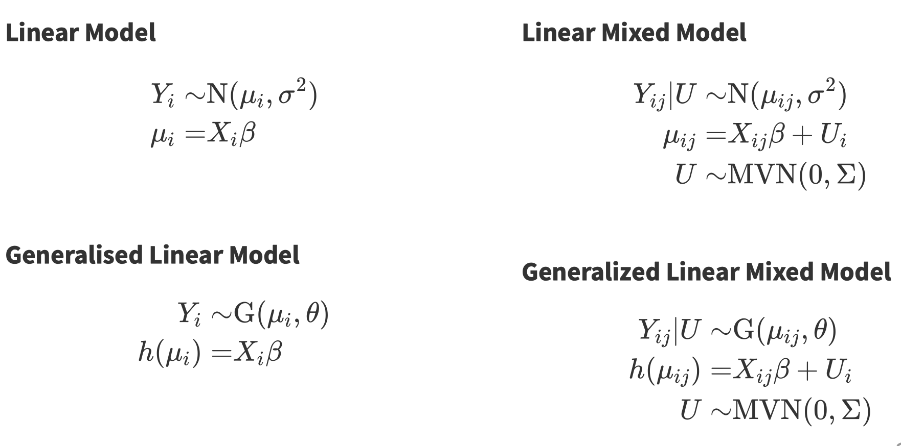
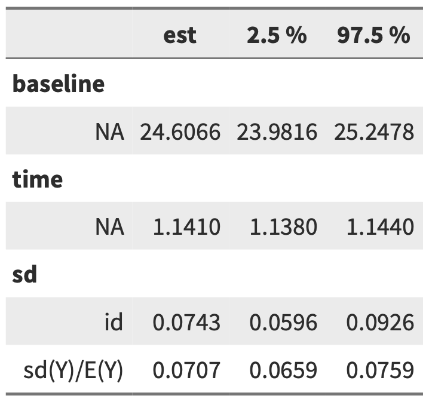

# Week 5 Generalized Linear Mixed Models (GLMM)

## Pros

- Powerful, combined GLM and LMM
- Can be used for many response distributions (poisson, binomial, gamma)
- Can be used even if some observations are not independent
- Fast and can be extended to handle somewhat more complex situations

## Cons

- Some standard ways for testing models don't apply
- Greater risk of making 'sensible' models that are too complex for our data to support

## Assumptions

1. Subjects are independent, even though observations within each subject are taken not to to be
2. Random effects come from a normal distribution
3. Random effects errors and within-unit residual errors have **constant variance**
4. The chosen **link function** is appropriate

## Interpretation

Example:

A one standard deviation difference in individual-level variation increases weight by $100\cdot[exp(0.0707)-1]=7%$

Every year it increases its weight by $100\cdot(1.14-1)=14%$

## Nested Model

`(1 | school / student)`

## Conclusion

1. GLMMs are easy to fit (Taylor Series/Gaussian Approximation)

2. Interpreting GLMM is similar to that of GLM

   